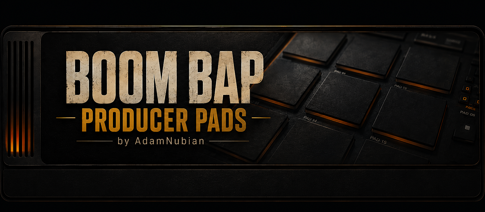

# Changelog

All notable changes to this project are documented here.
Format follows [Keep a Changelog](https://keepachangelog.com/), versioning
follows [Semantic Versioning](https://semver.org/).

## [1.5.0] — 2026-08-09

### Added
- The step sequencer now has its own SEQ tab, showing all 16 pads' patterns
  at once in a full grid instead of one pad's row at a time squeezed onto
  the Pads page — click a pad's name on the left to jump to editing it

### Fixed
- Hits recorded live while Record was armed now show up on the step grid
  right away instead of only appearing after you happened to click
  something else

## [1.4.0] — 2026-08-09

### Added
- An "Expand" button on the sample chopper now grows the waveform view
  to a noticeably bigger size (both wider and taller) so it's easier to
  place chop points and trim handles precisely — click it again to go
  back to the normal layout

## [1.3.0] — 2026-08-09

### Fixed
- Notes with a specific length in your DAW's piano roll (or held on the
  on-screen keyboard) now actually stop when they're supposed to instead
  of always playing the full sample — the pad fades out through its own
  Release setting instead of getting cut off with a click
- The Keys tab's pattern preview now actually locks to your DAW's
  play/stop and tempo position instead of running on its own separate
  clock that could drift out of time

### Added
- Record and Loop buttons in the toolbar, next to Play/Stop, so they're
  reachable from every tab instead of only Pads (Record) or Keys (Loop)

## [1.2.0] — 2026-08-09

### Fixed
- Turntable scratch was glitchy and too fast in some drag patterns —
  rebuilt to track the real speed of your drag instead of forcing
  playback to catch up within a single audio block
- Turntable Pitch and Volume now actually respond to MIDI Learn — the
  right-click menu was already there, it just didn't do anything

### Added
- Turntable momentum — letting go of the platter now spins the sound
  down naturally instead of stopping dead
- Turntable gained EQ (3-band), Filter, Reverb, a beat-length Loop, and
  hold-to-engage Stutter — the same set of tools the Boom Bap Producer
  Decks turntables have, all MIDI-learnable
- Right-click MIDI Learn now covers every knob and toggle in the plugin,
  not just most of them — including Roll, Record-arm, and the turntable
- Roll's on/off state now actually saves with your project (it used to
  silently reset every time you reopened it)
- The turntable now starts/stops with your DAW's own play/stop, and a
  new Play/Stop button in the toolbar (visible on every tab) also gives
  the standalone build a genuine one-click transport
- A persistent, playable keyboard strip at the bottom of the plugin —
  three modes: play whichever pad is selected chromatically, one key per
  pad, or the whole keyboard split into 16 zones (one per pad)
- The Keys tab now has its own Play/Loop preview, so you can audition a
  pattern on its own without needing the whole song playing
- Loading a sample (onto a pad, the turntable, or previewing in the
  browser) now happens in the background instead of freezing the UI —
  noticeable on larger files

### Changed
- Stems tab redesigned — colour-coded Low/Mid/High chips and clearer
  per-pad cards that show at a glance which pads are loaded and which
  have already been split. Same underlying feature, just easier to read

## [1.1.0] — 2026-08-07

### Added
- Auto BPM + key detection when you load a sample, plus a "Sync" button
  that matches the pad's Speed to your host's tempo
- Transient-aware auto-slice — a "Transients" button that slices at the
  sample's actual hits instead of equal divisions
- Per-pad output routing — route any pad to its own channel in your
  DAW's mixer instead of the shared stereo output
- Frequency-colored waveform — a "Freq" toggle in the sample editor
  tints the waveform by pitch content (low=red, high=blue)
- Cue-point quantize-to-beat — a "Quantize" toggle snaps chop points and
  trim handles to the beat grid (or nearest transient with no detected
  tempo)
- Refreshed branding, and a proper icon for the standalone app and the
  installed VST3
- The plugin now shows its version number right in the banner

## [1.0.1] — 2026-08-07

### Added
- Per-pad DSP chain: resonant filter (cutoff/resonance), ADSR envelope,
  pitch (tune/fine) and speed, reverse, normalize, bitcrush (ADR-0006)
- Real-time output metering with clip indication
- All per-pad DSP settings + swing converted to real, host-automatable
  parameters, with right-click MIDI Learn on every control (ADR-0008)
- Presets — save/load/delete named presets independent of any DAW project
  (ADR-0009)
- Real file-system sample browser with search, replacing the placeholder
  (ADR-0010, search added later — ADR-0016)
- Roll (note-repeat: press-and-hold a pad to auto-retrigger) and Auto-Slice
  (divide a region into N equal pieces) (ADR-0011)
- Full visual redesign: custom dark/gold "premium hardware sampler" look,
  rotary knobs, animated pad glow/pulse, restyled meter and browser
  (ADR-0012)
- Tabs: **STEMS** (3-band frequency split of a pad's sample, with drag-out
  and folder export), **TURNTABLE** (a dedicated scratch-capable deck,
  independent of the 16 pads), and **KEYS** (an on-screen keyboard plus a
  pitch-and-length-aware piano roll, with MIDI import/export) (ADR-0013,
  ADR-0014, ADR-0017, ADR-0019)
- Standalone build (`Boom Bap Producer Pads.exe`) — runs without a DAW,
  with its own audio/MIDI device selection and a "Seq Play" toggle to
  drive the step sequencer in the absence of a host transport (ADR-0015,
  ADR-0020)
- Ctrl+scroll zoom on the sample editor, anchored to the cursor (ADR-0016)
- Per-pad Pan control (equal-power), host-automatable and MIDI-learnable
  (ADR-0021)
- Live-record: pad hits played during playback write directly into the
  step grid instead of step-programming only (ADR-0021)
- Sample-accurate step triggering — steps now start on the exact sample,
  not just the right block (ADR-0021)
- Sample browser: drag a file straight onto a pad to load it, audition
  (preview) files before loading, favorite folders, and a recent-files
  list (ADR-0022)

### Fixed
- A state-restore bug where pads/steps not mentioned in an incoming preset
  or DAW project state could leak whatever was already loaded, instead of
  explicitly clearing (ADR-0009)
- Sample browser filenames getting clipped to a sliver a few folders deep
  into a real library (ADR-0012)
- Turntable scratch sounding like "a high-pitched jumbled" version of the
  sample rather than a real scratch — root-caused to an unclamped position
  accumulator that could diverge during boundary-hitting scratches; also
  reduced drag sensitivity and added a centre deadzone (ADR-0018)
- Step sequencer never advancing in the standalone build — confirmed via
  JUCE's own source that the Windows standalone wrapper never provides a
  playhead at all (ADR-0020)

## [0.1.0] — 2026-08-05

First working build. VST3, Windows only.

### Added
- 16-pad one-shot sample engine — load a sample per pad via file chooser,
  right-click menu, or drag-and-drop; trigger via MIDI (notes 36–51, real
  velocity) or UI click (fixed velocity); choke-per-pad retriggering
- 16-step sequencer per pad, synced to the host DAW's transport/tempo
  (not a free-running clock); swing control
- Pattern and sample assignments persist with the DAW project
- Original pad-grid UI with playhead highlight and per-pad selection for
  step editing
- `pluginval` strictness 5 validated; confirmed loading and playing in
  FL Studio

### Known limitations
- No sample trimming/start-point — full sample plays from 0 every time
- No per-pad volume/pan/ADSR controls
- Step triggering is block-quantized, not sample-accurate (a few ms of
  possible jitter)
- No live-record of pad hits into the step grid (step-programming only)
- Not yet load-tested in Reason or Ableton Live
- Windows only — no macOS/Logic build yet
