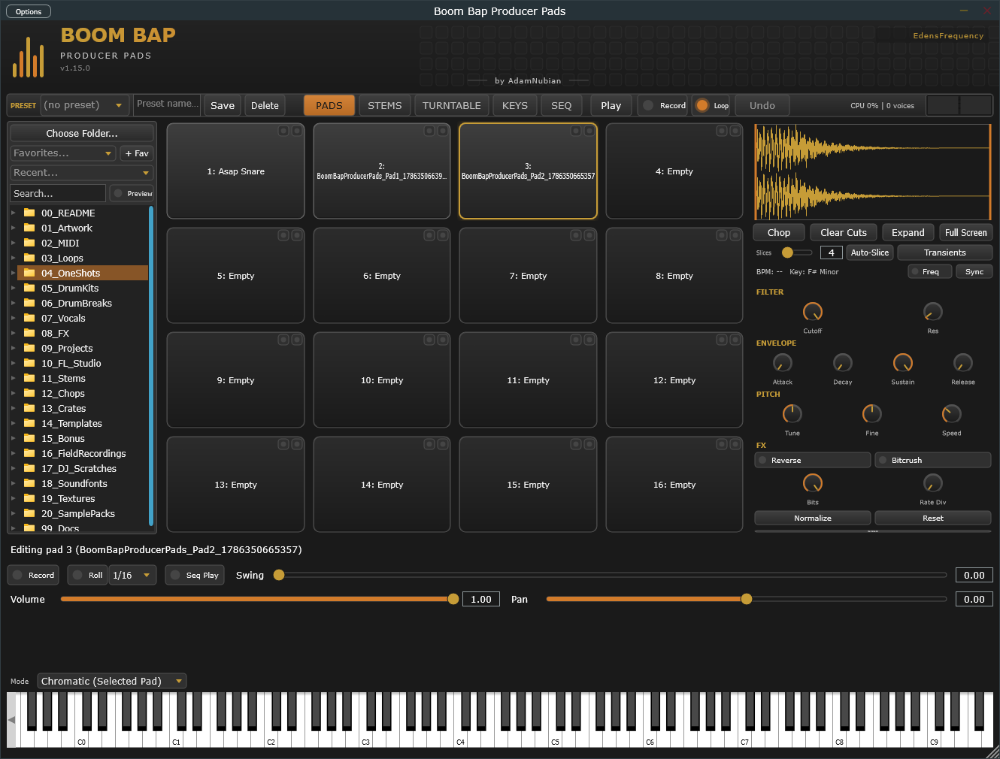

[&larr; Back to Usage overview](../USAGE.md) | [INSTALL](../INSTALL.md) | [LICENSE](../LICENSE.md) | [CHANGELOG](../CHANGELOG.md)

# Usage

The plugin has seven tabs, switched via the buttons in the toolbar strip
(top-left, next to the preset controls): **PADS**, **STEMS**, **TURNTABLE**,
**KEYS**, **DISCOVER**, **ARRANGEMENT**, and **BASS**. The preset bar and
output meter stay visible on every tab. The banner shows the installed
version number (e.g. `v1.51.0`) directly under the plugin name — check it
before reporting a bug, since the
fix you're looking for might already be in a newer build.

This guide is split by feature area — pick where you want to start:

- [The toolbar](modules/toolbar/toolbar-and-presets.md) — presets, undo/redo, Pad
  Quantize, Mono mode, metering, tabs
- **PADS tab**
    - [The pad grid & sample browser](modules/pads/pad-grid-and-browser.md)
    - [Sample editor](modules/sample-editor/sample-editor.md) — waveform, zoom, trim, chop
    - [DSP controls & output routing](modules/dsp-controls/dsp-controls.md) — filter,
      envelope, pitch, FX
    - [Step sequencer & Roll](modules/step-sequencer/step-sequencer-and-roll.md)
- [STEMS tab](modules/stems/stems-tab.md) — band/HPSS splitting, pre-mix levels,
  live preview
- [DISCOVER tab](modules/discover/discover-tab.md) — local crate browser + YouTube
  Crate
- [TURNTABLE tab](modules/turntable/turntable-tab.md) — scratch deck, Vinyl Sim
- [KEYS tab](modules/keys/keys-tab.md) — piano roll + on-screen keyboard
- [ARRANGEMENT tab](modules/arrangement/arrangement-tab.md) — bank timeline with
  next-action control
- [BASS tab](modules/bass/bass-tab.md) — dedicated bass voice with glide
- [MIDI Learn](modules/midi/midi-learn.md)
- [Saving your work & running standalone](saving-and-standalone.md)
