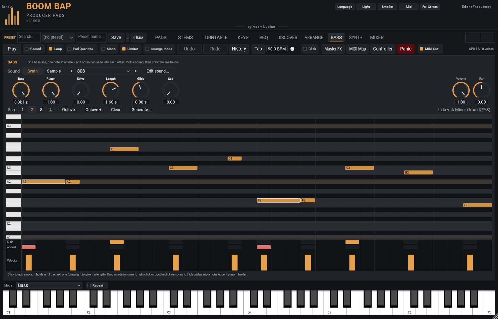
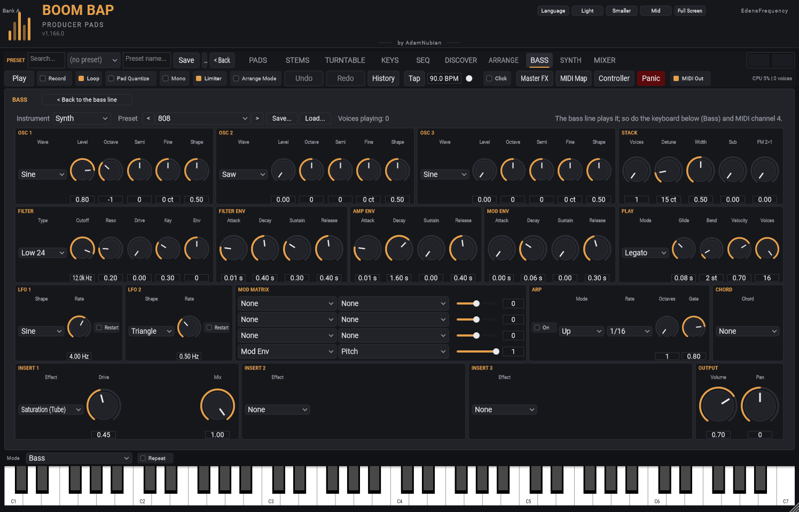

[&larr; Back to Usage overview](../../../USAGE.md) | [INSTALL](../../../INSTALL.md) | [LICENSE](../../../LICENSE.md) | [CHANGELOG](../../../CHANGELOG.md)

# BASS tab

**One bass line, one note at a time -- and notes can slide into each
other.** Pick a sound at the top, then draw the line in the grid. The bass
has its own strip in the MIXER and doesn't use a pad.

## 1. Pick a sound

**Sound: Synth or Sample.**

- **Synth** (the default) is a bass synth, ready to play. Pick a preset --
  **808**, **Distorted 808**, **Sub Bass**, **Reese**, **Acid**, **Fat
  Bass**, **Pluck Bass**, **Wobble Bass** -- or step through them with **<**
  and **>**. Then shape it with six knobs:
  - **Tone**: darker to brighter.
  - **Punch**: the 808 knock -- each note starts higher and drops onto its
    pitch.
  - **Drive**: grit and weight, so it cuts through small speakers.
  - **Length**: how long each note rings.
  - **Glide**: how long a slide takes to reach the next note.
  - **Sub**: a pure low sine an octave under, for weight.

  **Edit sound...** opens every control of the synth (the same ones as
  the SYNTH tab: oscillators, filter, envelopes, LFOs, mod matrix,
  effects) and every preset, and you can save your own. **< Back to the
  bass line** returns.

  
- **Sample** plays your own bass sound (an 808 you like, a sub, a bass
  note): **Load...** it or drop it on the tab. Its knobs are the sample's
  filter (**Cutoff**, **Res**), envelope (**Attack**, **Decay**, **Sustain**,
  **Release**), **Tune**, **Fine**, **Glide** time and **Loop**. Right-click
  a knob to MIDI-learn it.

**Volume** and **Pan** (right) work for both, and are the same as the
BASS strip in the MIXER.

## 2. Draw the line

The grid is a small piano roll: notes up the side, steps across (16 per
bar).

- **Click** to add a note. It holds until the next note starts, which is
  what most 808 lines want (the rest of a held note shows lighter). Drag
  right as you click to give it a set length instead.
- **Drag a note** to move it (up and down changes its note), or drag its
  right edge to change its length.
- **Right-click** or **double-click** a note to remove it.
- One note at a time: a new note inside a held one ends it there.
- **Scroll** over the grid to see higher or lower notes. The keyboard on
  the left plays a note when you click it.
- If you've set a **Key** and **Scale** on the KEYS tab, the grid shades
  the notes in that key (and says so, top right) -- stay on the lighter
  rows and the bass fits the rest of the beat.

Under the grid, one cell per note:

- **Slide**: glide into this note from the one before instead of starting
  it fresh (the note before has to run up to it). The Glide knob sets how
  long the slide takes.
- **Accent**: play this note harder.
- **Velocity**: drag the bars up or down.

## 3. Tools

- **Bars 1-4**: how long the line is. Going longer starts the new bars as
  copies of the ones you have.
- **Octave - / Octave +**: every note down or up an octave.
- **Clear**: remove every note.
- **Generate...**: write a line from a chord progression's root notes,
  across every bar. It opens on the KEYS tab's key; use the same Root,
  Scale and Progression as your chord pads to keep them together.

## Playing it live

The keyboard at the bottom plays the bass while the BASS tab is open (its
Mode switches to **Bass**, and back when you leave). From a DAW or
controller, **MIDI channel 4** plays it.

## Your older projects

A project saved before this version keeps its bass line (moved into the
grid as it was) and, if it had a bass sample, plays that sample. Projects
without one get the Synth's 808.
