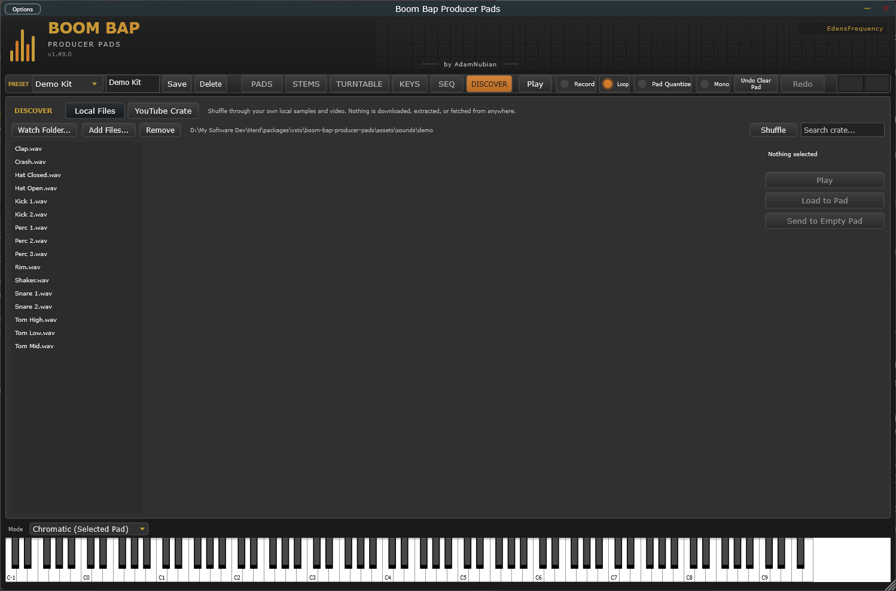

[&larr; Back to Usage overview](../../../USAGE.md) | [INSTALL](../../../INSTALL.md) | [LICENSE](../../../LICENSE.md) | [CHANGELOG](../../../CHANGELOG.md)
<hr>


<hr>


# DISCOVER tab



Two sub-tabs: **Local Files** (a crate/shuffle audition browser over
your own local sample/video library) and **YouTube Crate** (filter,
search, and get suggestions from YouTube videos you've tagged
yourself). Nothing here downloads or fetches anything automatically —
Local Files only auditions media you already have on disk, and YouTube
Crate only embeds videos the same way any website embeds one.

## Local Files

- **Watch Folder...** — point it at a folder (your downloads, a "new
  samples" folder, wherever you drop fresh material) and its audio and
  video files show up in the crate automatically, re-checked every
  couple of seconds.
- **Add Files...** — add specific files to the crate directly, without
  needing them all in one watched folder. **Remove** takes an added
  file back out (watch-folder files aren't removable this way — they
  just reflect whatever's actually in the folder).
- **Search** filters the crate list by filename.
- Click a file to select and preview it. Audio plays through the
  built-in preview voice; video files marked `[VIDEO]` play with
  picture and sound in the central preview pane. **Shuffle** picks one
  at random and previews it. **Play** replays/toggles the current
  selection (for video).
- **Load to Pad** and **Send to Empty Pad** only work for local audio
  files — a video's audio can't be pulled out into a pad (no built-in
  demuxer).

## YouTube Crate

- **Paste a YouTube URL** (or bare video ID) and hit **Watch** to embed
  that video using YouTube's own player, right in the tab. This is
  view-only — nothing is downloaded, extracted, or saved, the same as
  embedding a video on any webpage.
- **Search YouTube...** searches YouTube directly by keyword instead of
  requiring you to already have a URL — type a query, get a results
  list, double-click one to jump straight into the **Add to Crate**
  dialog with the title/channel already filled in.
  - This needs a **search proxy URL** configured first (a small
    relay service — see below for why). Paste it into the field at the
    top of the search popup; it's remembered for next time. Until one's
    configured, the button still works but shows "No search proxy
    configured" instead of results — Watch/paste-a-URL keeps working
    either way, this only affects the *search* convenience.
  - Why a proxy instead of searching YouTube directly: a real YouTube
    search needs a Google API key, and a key baked into a program that
    gets installed on other people's computers can be extracted and
    abused. The proxy holds that key server-side instead — this plugin
    only ever talks to the proxy, never to Google directly.

  ```mermaid
  flowchart LR
      P["Plugin\n(this app)"] -- "search query" --> W["Your search proxy\n(small relay service)"]
      W -- "holds the API key,\ncaches recent results" --> Y["YouTube Data API"]
      Y -- "results" --> W
      W -- "results\n(no key exposed)" --> P
  ```
- **Add to Crate...** tags the pasted video (title, artist, channel,
  genre, style, year, key, BPM) and saves it to your own local crate —
  this is what the filter bar and Up Next queue search over. Nothing is
  auto-populated; you tag what you add.
- The **filter bar** (Search / Genre / Style / Decade / Key / Mode /
  BPM min-max / Starred only) narrows your crate down; **Apply** runs
  it, **Clear** resets everything.
- **UP NEXT** ranks the filtered results by similarity to whatever's
  currently playing (genre/style/artist/channel match, era proximity,
  key compatibility, BPM closeness) — click any entry to watch it.
  **Shuffle** picks something at random from the filtered set; **Next**
  advances to the top of the queue.
- **Favorite** stars the current video (usable with the Starred-only
  filter); **Remove** deletes it from your crate entirely.
- Load to Pad isn't available here — a YouTube embed was never a local
  file to begin with, so there's nothing to load onto a pad.
