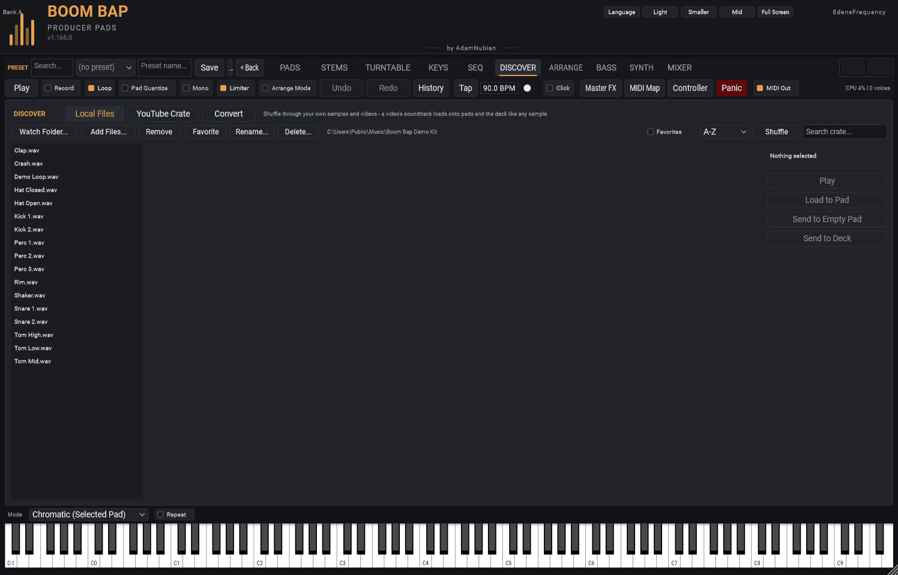

[&larr; Back to Usage overview](../../../USAGE.md) | [INSTALL](../../../INSTALL.md) | [LICENSE](../../../LICENSE.md) | [CHANGELOG](../../../CHANGELOG.md)
<hr>


<hr>


# DISCOVER tab



Three sub-tabs: **Local Files** (a crate/shuffle audition browser over
your own local sample/video library), **YouTube Crate** (filter,
search, and get suggestions from YouTube videos you've tagged
yourself) and **Convert** (turn audio files and videos into WAV, AIFF,
FLAC or OGG, a whole folder at a time). Nothing here downloads or
fetches anything automatically — Local Files and Convert only work
with media you already have on disk, and YouTube Crate only embeds
videos the same way any website embeds one.

## Local Files

- **Watch Folder...** — point it at a folder (your downloads, a "new
  samples" folder, wherever you drop fresh material) and its audio and
  video files show up in the crate automatically, re-checked every
  couple of seconds.
- **Add Files...** — add specific files to the crate directly, without
  needing them all in one watched folder. You can also **drag files or a
  folder** from Explorer onto the crate: a folder adds its audio and video
  (not its subfolders). **Remove** takes an added
  file back out (watch-folder files aren't removable this way — they
  just reflect whatever's actually in the folder).
- **Search** filters the crate list by filename. **Favorites** shows only
  starred clips, and the sort box lists the crate **A-Z** or **Newest**
  first (newest file on disk, handy for fresh downloads).
- **Managing clips.** Select a clip, then:
  - **Favorite** stars it (a gold star in the list); click again
    (**Unfavorite**) to unstar it.
  - **Rename...** renames the actual file on disk (the extension stays
    the same). If the clip is on pads or a deck in this project, they
    follow the new name, so the project saves it. Other projects that
    use the file will look for the old name.
  - **Delete...** moves the actual file to the Windows **Recycle Bin**,
    after asking. You can restore it from there. If it's on pads or a
    deck in this project, the message says where. They keep their sound
    until the project is closed, but won't find the file next time. The
    **Delete** key does the same from the list.
  - **Right-click** a clip for all of the above, plus Play, Load to Pad,
    Send to Empty Pad, Send to Deck, Show in Explorer and Remove from
    Crate.
- Click a file to select and preview it. Audio plays through the
  built-in preview voice; video files marked `[VIDEO]` play with
  picture and sound in the central preview pane. **Shuffle** picks one
  at random and previews it. **Play** replays/toggles the current
  selection (for video). With the list focused, the **arrow keys**
  audition the next/previous file.
- **Load to Pad** (or double-click) puts the file on the selected pad;
  **Send to Empty Pad** puts it on the first empty pad of the current
  bank. The line under the buttons shows how it's going ("Loading ...
  onto pad 3", then "Loaded ..."): a long video takes a few seconds.
- **Send to Deck** loads it onto the turntable deck and switches to the
  TURNTABLE tab once it's there — ready to scratch, or to chop onto pads
  with [Deck Chop](../turntable/turntable-tab.md#deck-chop).
- **Videos work too.** All three load a video's **soundtrack**, exactly
  like an audio file: chop a music video, a live clip or a phone
  recording the same way you'd chop a record. A few things to know:
  - What plays is whatever Windows itself can decode: MP4 and MOV
    (H.264/AAC — almost every phone, camera and download), WMV/ASF, 3GP
    and 3G2, camcorder files (MTS, M2TS, TS), MPG, and MKV/AVI with
    common codecs. WEBM needs the free Windows codec from the Microsoft
    Store. FLV isn't supported (Windows has no reader for it); convert it
    with another tool first. Audio: WAV, AIFF, FLAC, OGG, MP3, M4A/AAC,
    WMA, M4B (audiobooks), M4R (ringtones) and MKA. If Windows can't decode a video's sound (or it
    has none), it's marked *can't play* and loading it tells you so.
  - A video whose sound is completely silent — a screen or webcam
    recording made without a microphone — loads, but you get a message
    saying it's silent.
  - The picture and the sound are decoded separately. If Windows can't
    show a video's picture in the preview pane, Local Files plays just
    the sound (marked *sound only*), and it still loads onto pads and
    the deck.
  - Surround soundtracks are mixed down to stereo.
  - Pads and the deck take the **first 20 minutes** of a very long file
    (a whole film would need gigabytes of memory). To keep all of it,
    convert it first (below).
  - Saving a preset or sharing a kit stores the soundtrack as a WAV,
    not the whole video.
- M4A and AAC audio files load too (also through Windows' own decoder).

## YouTube Crate

- **Paste a YouTube URL** (or bare video ID) and hit **Watch** to embed
  that video using YouTube's own player, right in the tab. This is
  view-only — nothing is downloaded, extracted, or saved, the same as
  embedding a video on any webpage.
- **Search YouTube...** searches YouTube directly by keyword instead of
  requiring you to already have a URL — type a query, get a results
  list, double-click one to jump straight into the **Add to Crate**
  dialog with the title/channel already filled in.
  - This needs a **search proxy URL** configured first (a small
    relay service — see below for why). Paste it into the field at the
    top of the search popup; it's remembered for next time. Until one's
    configured, the button still works but shows "No search proxy
    configured" instead of results — Watch/paste-a-URL keeps working
    either way, this only affects the *search* convenience.
  - Why a proxy instead of searching YouTube directly: a real YouTube
    search needs a Google API key, and a key baked into a program that
    gets installed on other people's computers can be extracted and
    abused. The proxy holds that key server-side instead — this plugin
    only ever talks to the proxy, never to Google directly.

  ```mermaid
  flowchart LR
      P["Plugin\n(this app)"] -- "search query" --> W["Your search proxy\n(small relay service)"]
      W -- "holds the API key,\ncaches recent results" --> Y["YouTube Data API"]
      Y -- "results" --> W
      W -- "results\n(no key exposed)" --> P
  ```
- **Add to Crate...** tags the pasted video (title, artist, channel,
  genre, style, year, key, BPM) and saves it to your own local crate —
  this is what the filter bar and Up Next queue search over. Nothing is
  auto-populated; you tag what you add.
- The **filter bar** (Search / Genre / Style / Decade / Key / Mode /
  BPM min-max / Starred only) narrows your crate down; **Apply** runs
  it, **Clear** resets everything.
- **UP NEXT** ranks the filtered results by similarity to whatever's
  currently playing (genre/style/artist/channel match, era proximity,
  key compatibility, BPM closeness) — click any entry to watch it.
  **Shuffle** picks something at random from the filtered set; **Next**
  advances to the top of the queue.
- **Favorite** stars the current video (usable with the Starred-only
  filter); **Remove** deletes it from your crate entirely.
- Load to Pad isn't available here — a YouTube embed was never a local
  file to begin with, so there's nothing to load onto a pad.

## Convert

Batch-converts your own audio files and videos into audio files. The
classic job: a folder of music videos or live footage in, a folder of
WAVs out, ready to dig through.

1. **Add Files...**, **Add Folder...**, or drag files and folders onto
   the list. **Include subfolders** decides whether Add Folder (and
   dropping a folder) goes into subfolders too. Videos are marked
   `[VIDEO]` and convert to their soundtrack. **Remove** takes the
   selected rows out; **Clear** empties the list.
2. Pick what to convert to:
   - **Format** — **WAV** or **AIFF** (uncompressed, for any DAW or
     sampler), **FLAC** (lossless and about half the size), or **OGG
     Vorbis** (lossy, smallest; choose the **OGG quality**, 128-320 kbps).
   - **Sample rate** — keep the original, or 44.1 / 48 / 88.2 / 96 kHz.
   - **Bit depth** — 16-bit, 24-bit, or 32-bit float (WAV only; AIFF and
     FLAC go up to 24-bit, OGG has no bit depth).
   - **Channels** — keep, **Mono** (both sides averaged) or **Stereo**.
   - **Normalize peaks** — turns each file up or down so its loudest
     moment sits just under full scale (-0.3 dB; -1 dB for OGG).
   - **Trim silence at start and end** — cuts quiet lead-in and tail
     (anything below -60 dB), keeping a few milliseconds so soft
     attacks and decays aren't clipped.
3. Choose where files go: **Save next to each original**, or an
   **Output Folder...** (it starts as *Music\Boom Bap Converted*). With
   an output folder, **Keep folder structure** recreates each file's
   subfolders from the folder you added it from.
4. Press **Convert**. Files convert one at a time in the background —
   keep working in other tabs. Each row shows its progress and then
   *Done* (with the new file's name) or *Failed* and why. **Cancel**
   stops after the current block; nothing half-written is left behind.
5. Double-click a finished row to show the file in Explorer.
   **Watch Output Folder** opens the output folder in **Local Files**,
   so you can audition what you converted and load it straight onto
   pads or the deck.

Nothing is ever overwritten: if a file with the same name already
exists (including the original itself), the new one gets a number,
like `Break (2).wav`. Pressing **Convert** again converts only what
hasn't succeeded yet; once everything has, it converts the whole list
again (handy for making the same files in a second format). Your
settings are remembered for next time.
