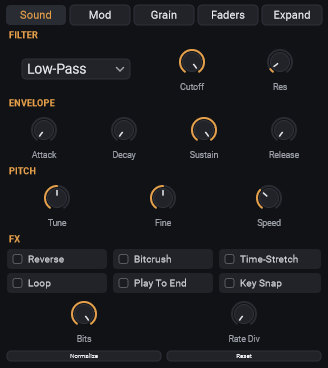
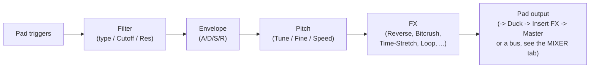

[&larr; Back to Usage overview](../../../USAGE.md) | [INSTALL](../../../INSTALL.md) | [LICENSE](../../../LICENSE.md) | [CHANGELOG](../../../CHANGELOG.md)

# DSP controls & output routing

Below the sample editor on the PADS tab — the same per-pad chain, always
following whichever pad is selected. Every knob/toggle on the Sound page is
a real, host-automatable parameter and supports [MIDI Learn](../midi/midi-learn.md).
Scrolling over any knob nudges its value by a small, precise step.

The buttons along the top of the panel pick what it shows: **Sound** (the
controls below), **Mod** (the [Mod page](#the-mod-page): LFO, pitch
envelope, velocity response, loop shaping and Voices) or **Grain** (the
[Grain page](#the-grain-page): granular mode). When a pad is in granular
mode its button reads **Grain \***, so you can tell from any page.

**Faders** (top of the panel) switches every knob on the Sound page to
a vertical fader instead — same controls, same values, same MIDI Learn
bindings, just a different shape (bottom-to-top strips instead of dials),
if that's a layout you find quicker to read or automate by ear. **Expand**
grows this panel by temporarily shrinking the sample editor above it, for
more room to work the strips precisely. Both are purely visual — nothing
about the sound or the underlying parameters changes.

- **Filter** — a type picker, Cutoff (20 Hz–20 kHz) and Res(onance)
  (0.1–10), reset fresh on every trigger. The types:
  - **Low-Pass** (the default) keeps the lows and removes the highs: turn
    Cutoff down to make a sound darker or more muffled.
  - **High-Pass** removes the lows: thin out a sample so it sits above
    the kick and bass.
  - **Band-Pass** keeps a band around Cutoff: the "telephone" or "radio"
    sound. Res makes the band narrower.
  - **Notch** removes a narrow band around Cutoff and keeps the rest.

  Switching away from Low-Pass while Cutoff is fully open (20 kHz) moves
  Cutoff somewhere audible for you (200 Hz for High-Pass, 1 kHz for the
  others), since a fully open high-pass would be silent.
- **Envelope** — Attack, Decay, Sustain, Release (0–5 seconds, Sustain is a
  0–1 level). This is position-based, not held-note-based: since pads are
  one-shot, Attack/Decay ramp in from the start of the region and Release
  ramps out over the last R seconds *before* the region's natural end.
- **Pitch** — Tune (±24 semitones), Fine (±100 cents), Speed (0.5x–2.0x).
  By default Speed is a simple resample-based stretch, so it changes
  pitch too — turn on **Time-Stretch** (in the FX row) to decouple them:
  Speed then changes duration only, while Tune/Fine keep controlling
  pitch on their own. Time-Stretch runs in the background and takes a
  moment to catch up after you change Speed or first turn it on —
  playback keeps working normally with the old behavior in the meantime.
  **Key Snap** (in the FX row) rounds Tune to notes that are actually in
  the pad's detected key instead of any raw semitone — needs a key to
  have been detected first (see the BPM/Key readout in the [sample
  editor](../sample-editor/sample-editor.md)).
- **FX** — Reverse (plays the region backward), Bitcrush (Bits: 2–16,
  Rate Div: 1–32, a sample-rate-reduction/decimation effect for lo-fi
  grit), Time-Stretch and Key Snap (see Pitch above), **Loop** (repeats
  the region instead of stopping — best used with a held MIDI note or the
  on-screen keyboard, since releasing the note is what stops it), and
  **Play To End** (ignores note-off, always plays the full region
  regardless of how short the trigger was).
- **Normalize** — scans the pad's current region and boosts it so its peak
  hits 0dBFS. **Reset** removes that boost. Non-destructive; recomputed
  automatically if you re-chop or re-trim.

## The Mod page

Press **Mod** at the top of the panel. These controls make a pad's sound
move and respond to how hard you play. Like everything else in this
panel they follow the selected pad, and they're saved with your project,
in bank kits and in presets. They're also copied by A/B compare and apply
to every batch-selected pad. Unlike the Sound page, they aren't DAW
parameters, so they can't be automated or MIDI-learned -- except the LFO's
**Depth** (see below). **Reset Mod** turns all of them back off for the pad
(the filter type and Voices stay).

- **LFO**: a slow wobble. Pick what it moves:
  - **Pitch** for vibrato. Low Depth is a gentle vibrato; high Depth is a
    siren, up to an octave either way.
  - **Filter** for a "wah" sweep, up to 4 octaves either way around
    Cutoff.
  - **Volume** for tremolo. Full Depth dips all the way to silence.
  - **Pan** to swing the sound left and right.

  **Shape** sets how it moves: Sine (smooth), Triangle, Square (on/off,
  softened so it doesn't click), Saw Down, or Random (a new level each
  cycle). **Rate** is in cycles per second. Turn on **Sync** to lock it
  to the tempo instead, from once a bar down to every 1/16 note. The LFO
  starts from the beginning on every hit, so a pad sounds the same each
  time you play it (Random included).

  **Depth can be automated in your DAW.** Each pad has a parameter called
  **Pad N LFO Depth** (Pad 1 LFO Depth, Pad 2 LFO Depth...): draw
  automation for it to open a filter sweep over a build-up, or bring in
  vibrato on the last bar. The Depth knob follows the automation while it
  plays. It's also saved with the pad everywhere the other Mod settings
  are.
- **Pitch Envelope**: **Amount** bends the pitch at the moment of the hit
  (up to 24 semitones either way), and it glides back to the pad's own
  pitch over the **Glide** time. A positive Amount with a short Glide
  (50-150 ms) gives a kick or tom a punchy "thump"; a long Glide gives a
  tape-start or riser feel.
- **Velocity**: how the pad responds to how hard you hit it.
  **Filter** makes softer hits darker, up to 4 octaves of Cutoff at the
  softest. **Start** makes softer hits start later into the sound (up to
  50 ms), skipping some of the attack. Both do nothing on full-velocity
  hits.
- **Loop** (needs **Loop** turned on on the Sound page):
  **Ping-Pong** plays the loop forward, then backward, then forward
  again. **X-Fade** (up to 500 ms) smooths the loop point: the end of the
  loop fades into its start, so a loop chopped at an awkward spot doesn't
  click or thump each time round. X-Fade works on forward loops (not
  Reverse or Ping-Pong).
- **Voices**: how many hits of this pad can sound at once.
  - **1 - cut** (the default): a new hit stops the one before it, with a
    tiny fade so it doesn't click.
  - **2 to 8**: earlier hits keep ringing underneath the new one. Use this
    for long cymbals or 808s that shouldn't choke themselves, rolls that
    overlap, or playing chords on the KEYS tab from one pad. When a pad
    runs out of voices, its oldest hit fades out.

  Choke groups, Mono mode and the stop button still cut every voice. The
  pad shows as playing while any of its hits still sounds.

## The Grain page

Press **Grain** at the top of the panel and turn on **Granular**. Instead
of playing its sample from start to end, the pad now plays a *cloud* of
tiny overlapping pieces of it ("grains"), each a few milliseconds to half
a second long and faded in and out. Use it to turn a vocal, a chord or a
sustained note into a pad, a texture or a drone, or to freeze a single
moment of a sound and hold it.

Like the Mod page, these settings follow the selected pad, are saved with
your project, in bank kits and presets, and are copied by A/B compare and
batch selection. They aren't DAW parameters. **Reset Grain** puts the
knobs (and the shape) back to their defaults and leaves Granular on or
off.

**Shape** (beside the Granular switch) sets how each grain rises and
falls:

- **Smooth** (the default): fades in and out -- soft, blended clouds.
- **Flat**: full level between short fades, so each grain keeps more of
  the sample's own attack and body.
- **Sharp**: starts at once and dies away, like a plucked or struck note
  -- rhythmic, glitchy clouds, especially at low Density.
- **Swell**: the reverse: rises and stops -- a backwards, breathing
  texture.

The level stays about the same whichever shape you pick.

- **Cloud**
  - **Size**: how long each grain is (10-500 ms). Short grains sound
    buzzy and blurred; long grains sound more like the sample itself.
  - **Density**: how many grains start each second (1-100). Low is sparse
    and stuttery, high is a smooth wash. The level stays about the same
    as you turn it up.
  - **Position**: where in the sample the cloud starts, from 0% (the
    start) to 100% (the end). With Reverse on, it counts from the end.
  - **Scan**: how fast the cloud moves through the sample. **100%** moves
    at the sample's own speed, **50%** at half speed (a slow stretch),
    **0** *freezes* it on one moment, and below 0 moves backward.
    Double-click the knob to go back to 0. When the cloud reaches the end
    of the sample it carries on from the start.
- **Spread**
  - **Jitter**: scatters each grain's start a little around the cloud's
    position, so the cloud sounds less mechanical. High Jitter mixes
    moments from all over the sample.
  - **Pitch**: each grain plays up to this many semitones above or below
    the pad's pitch, at random. A few semitones gives a chorus-like
    shimmer; 12 gives a cloud of notes.
  - **Stereo**: how far grains spread left and right.

How long a granular hit lasts: as long as the pad would normally play
(its region at its pitch and speed), with the Sound page's envelope
shaping it. For a sound that keeps going for as long as you hold the note,
turn on **Loop** on the Sound page. The pad's Tune, Fine and Speed set the
grains' pitch, and its filter, envelope, LFO and FX all still apply. A
pitch LFO or the Pitch Envelope bends every sounding grain as it plays,
so vibrato and pitch drops work on a cloud the way they do on the plain
sample.
Granular mode also sounds the same in **Export WAV** and **Export Full
Song**. It replaces the loop shaping options (Ping-Pong and X-Fade) while
it's on.

## Output routing

Pads 1-16 each have their own dedicated stereo output pair, so you can
send an individual pad to its own channel in your DAW's mixer instead of
the shared master output — useful for processing the kick separately
from the rest of the kit, for example. This is off by default; enable it
from your DAW's own multi-output routing UI for this plugin instance
(exactly how varies by DAW — look for "add output" or similar on the
plugin's mixer channel). Once a pad's own output is enabled, that pad's
audio goes *only* to its own channel, not also into the main mix.

If a bank's [grid size](../pads/pad-grid-and-browser.md) is set larger
than 4x4, pads 17 and up always play through the main mix — dedicated
per-pad outputs are capped at 16 regardless of grid size, since a real
stereo output bus per pad adds up fast on the host side (tested up to a
noticeable routing-dialog slowdown well before 64).
