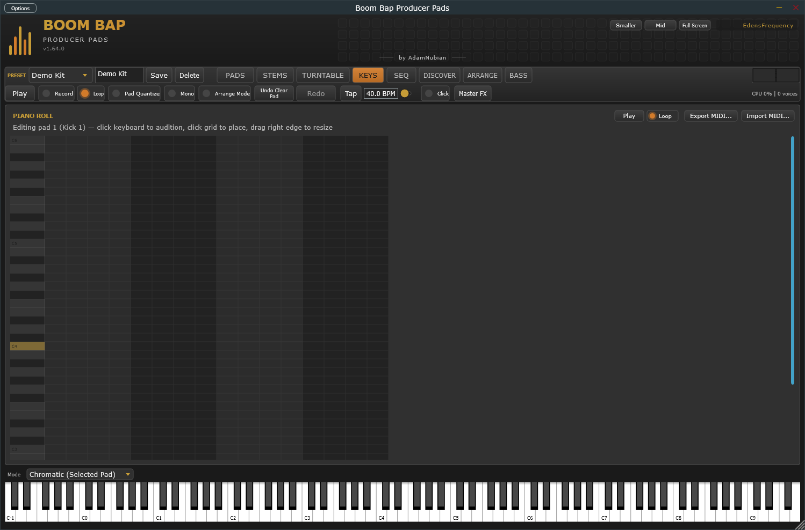

[&larr; Back to Usage overview](../../../USAGE.md) | [INSTALL](../../../INSTALL.md) | [LICENSE](../../../LICENSE.md) | [CHANGELOG](../../../CHANGELOG.md)
<hr>


<hr>


# KEYS tab



A vertical piano keyboard on the left plus a 16-step x pitch grid (the
piano roll) on the right, both scrolling together. This always plays and
edits whichever pad is currently selected on the PADS tab — it's not a
separate instrument, it's a melodic/chromatic way to play and sequence that
same pad's sample.

- **Click or drag along the keyboard strip** to audition the selected pad
  at different pitches. The highlighted row is MIDI note 60 (middle C) —
  that's the pad's own natural pitch (its Tune/Fine settings), with every
  row above or below shifting by a semitone (±24 semitones total, matching
  the Tune knob's own range).
- **Click an empty grid cell** to place a note at that step and pitch — it
  previews immediately and defaults to a length of 1 step.
- **Click an already-active note** (no dragging) to remove it.
- **Drag right from a note's start cell** to resize it — notes stop
  (with a short fade, not a hard click) once they reach their length,
  rather than always playing the pad's full sample. Drag right immediately
  after placing a new note to set its length in the same gesture.
- The playhead highlights the current step in sync with the regular step
  sequencer — this is the *same* pattern data, just a pitch-and-length-aware
  view of it. Anything you place here also shows as "on" in the plain
  [step sequencer](../step-sequencer/step-sequencer-and-roll.md), and vice versa.
- **Export MIDI...** — saves the selected pad's pattern as a standard
  `.mid` file, so you can drag it into your DAW's own piano roll/playlist.
- **Import MIDI...** (button, or just drag a `.mid` file onto the panel) —
  loads a `.mid` file's notes onto the selected pad's pattern, replacing
  whatever was there. Reads the file's own tempo resolution, so patterns
  exported from other software should import correctly too.
- **Chords...** generates a chord progression across several pads at
  once — different from everything else on this tab, which edits one
  pad's pattern at a time.

  ```mermaid
  flowchart TD
      A["Load the SAME sustained\nsample onto several pads\n(these become your 'voice pads')"] --> B["Click Chords..."]
      B --> C["Check which pads are voice pads,\npick a root note, scale, and progression"]
      C --> D["Click Generate"]
      D --> E["Each voice pad gets one note\nof the chord at steps 1/5/9/13 —\nplaying together, they sound as a chord"]
  ```

  - This needs pads with the **same sustained sample already loaded** —
    the button doesn't load anything for you, it only writes pitch/timing
    into pads you've already prepared.
  - More voice pads than a triad has notes (3) doesn't repeat a pitch —
    extra voices add the same notes an octave higher instead, so a
    5-voice chord still sounds like real harmony, not doubling.
  - Generate **replaces** each checked pad's whole pattern (not a merge)
    — same one-undo-snapshot safety net as every other generator here.
  - Favorited pads are protected here too.
  - **Export as .mid...** (inside the same popup) saves whichever
    checked pads' patterns as one MIDI file — works even before you've
    clicked Generate, so you can export a chord you built by hand too.

- **Melody...** generates a melody on the currently selected pad —
  unlike Chords, this only ever touches one pad.

  ```mermaid
  flowchart TD
      A["Click Melody..."] --> B["Pick a root note and scale"]
      B --> C["Click Generate"]
      C --> D["A scale-constrained random-walk\nmelody is written onto the selected pad"]
  ```

  - The melody's pitch drifts up and down within your chosen scale
    rather than jumping randomly — a more musical result than pure
    randomization.
  - Generate **replaces** the pad's whole pattern, same one-undo-
    snapshot safety net as every other generator here. Favorited pads
    are protected.
