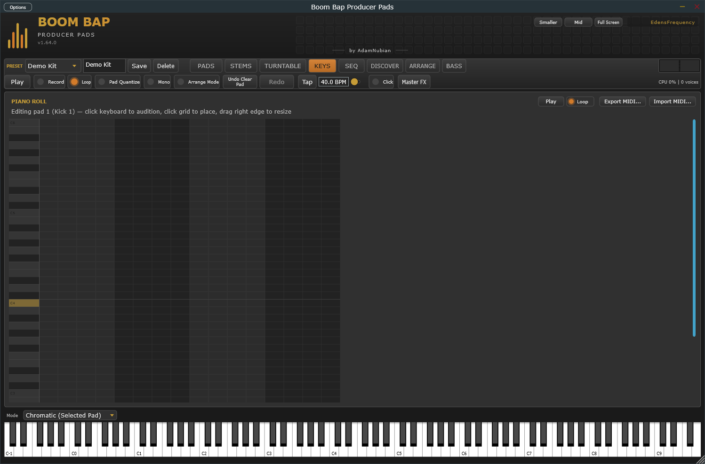

[&larr; Back to Usage overview](../../../USAGE.md) | [INSTALL](../../../INSTALL.md) | [LICENSE](../../../LICENSE.md) | [CHANGELOG](../../../CHANGELOG.md)
<hr>


<hr>


# KEYS tab



KEYS has two editors -- pick one with the switch at the top left:

- **Synth part**: a part for the SYNTH tab's instrument -- chords and
  melodies, 1 to 8 bars, looping with the transport. See the next section.
- **Pad melody**: the selected pad's own melody, one note per step (the
  rest of this page after the next section).

## Synth part

A piano roll for the synth. It plays whenever the transport plays (the
Play button at the top, or your DAW), looping every 1-8 bars.

- **Bars** sets how long it is; **Grid** is where notes land and how far
  they move: 1/4, 1/8, 1/16, 1/32, triplets (1/8T, 1/16T) or Off.
  **Width** spreads the beats out (then scroll sideways); **Zoom** (top
  right) makes the rows taller.
- **Draw**: click to add a note, the same length as the last one you made
  or set; drag right as you click to set its length. Stack notes on the
  same beat for **chords**. Drag a note to move it (hold **Alt** to copy),
  or drag its right edge to resize it. The same **Select** and **Erase**
  tools, **Key**, **Scale** and **Snap to scale** work here too.
- **Double-click** or **right-click** a note to remove it.
- **Keys**: **Delete**, **Up/Down** (transpose; **Shift**: an octave),
  **Left/Right** (a grid step), **Ctrl+A**, **Ctrl+D** (a copy of the
  selection straight after it), **Ctrl+Z** / **Ctrl+Y** (undo, redo -- or
  the **Undo** and **Redo** buttons), **Esc**.
- **Quantize** moves the selected notes (or all of them) onto the grid.
  **Clear** removes every note.
- **Chords...** writes a chord progression into the part: root, scale,
  progression, rhythm (one chord a bar, two a bar, or stabs on every
  beat), octave, and sevenths if you want them. It opens in the KEYS key.
- The keyboard on the left plays the synth; the lane underneath sets
  velocity (drag the bars); the bottom row shows and changes the selected
  notes' note, length (in 16th steps), velocity and chance.
- **Import MIDI...** (or drop a .mid file) brings every note of a MIDI file
  in, up to 8 bars; **Export MIDI...** and the drag handle next to it take
  the part out to your DAW.
- The sound is the SYNTH tab's: pick a preset there. **Export WAV**
  includes the part.

## Pad melody

A vertical piano keyboard on the left plus a 16-step x pitch grid (the
piano roll) on the right, both scrolling together. This always plays and
edits whichever pad is currently selected on the PADS tab — it's not a
separate instrument, it's a melodic/chromatic way to play and sequence that
same pad's sample.

The grid fills the whole panel: the steps stretch to its width, and at
the left end of **Zoom** every row fits its height (slide right for taller
rows, then scroll). The beat numbers run along the top, and each note's
velocity shows in the lane underneath.

- **Click or drag along the keyboard strip** to audition the selected pad
  at different pitches. The highlighted row is MIDI note 60 (middle C) —
  that's the pad's own natural pitch (its Tune/Fine settings), with every
  row above or below shifting by a semitone (±24 semitones total, matching
  the Tune knob's own range).
- **Three tools** (top left):
  - **Draw**: click an empty spot to place a note (drag right in the same
    move to make it longer). Drag a note to move it, drag its right edge to
    resize it. Hold **Alt** (or **Ctrl**) while dragging to copy instead.
  - **Select**: drag a box around notes to select them (**Shift** adds to
    the selection), then drag them to move or copy them together.
  - **Erase**: click or drag over notes to remove them.
- **Removing a note**: double-click it or right-click it, with any tool.
- **Keys** (after clicking the grid): **Delete** removes the selected
  notes, **Up/Down** transposes them (**Shift**: an octave), **Left/Right**
  moves them a step, **Ctrl+A** selects every note, **Esc** clears the
  selection.
- **Key** and **Scale**: the scale's rows are shaded lighter and the key's
  own note is tinted, so it's easy to stay in key. Scales: Major, Minor,
  Harmonic Minor, Dorian, Phrygian, Lydian, Mixolydian, Pentatonic Major
  and Minor, Blues; **None** shows the piano's white and black keys.
  **Snap to scale** makes new and moved notes land on the scale's notes.
  Your project remembers all three.
- **Velocity lane**: drag up or down over a note's bar to set how hard it
  plays; drag across several bars to draw a shape.
- **Selected note** (bottom row): the note, its length, velocity and
  chance (how likely it is to play each time round) of the selected note.
  Change one and every selected note gets it.
- Notes stop (with a short fade, not a hard click) once they reach their
  length, rather than always playing the pad's full sample. Louder notes
  look brighter, less likely ones fainter.
- One note per step, for now: this edits the pad's own step pattern. Chords
  and longer clips come with the KEYS clip editor (roadmap Phase 99).
- The playhead highlights the current step in sync with the regular step
  sequencer — this is the *same* pattern data, just a pitch-and-length-aware
  view of it. Anything you place here also shows as "on" in the plain
  [step sequencer](../step-sequencer/step-sequencer-and-roll.md), and vice versa.
- **Export MIDI...** — saves the selected pad's pattern as a standard
  `.mid` file, so you can drag it into your DAW's own piano roll/playlist.
- **Import MIDI...** (button, or just drag a `.mid` file onto the panel) —
  loads a `.mid` file's notes onto the selected pad's pattern, replacing
  whatever was there. Reads the file's own tempo resolution, so patterns
  exported from other software should import correctly too.
- **Chords...** generates a chord progression across several pads at
  once — different from everything else on this tab, which edits one
  pad's pattern at a time.

  ```mermaid
  flowchart TD
      A["Load the SAME sustained\nsample onto several pads\n(these become your 'voice pads')"] --> B["Click Chords..."]
      B --> C["Check which pads are voice pads,\npick a root note, scale, and progression"]
      C --> D["Click Generate"]
      D --> E["Each voice pad gets one note\nof the chord at steps 1/5/9/13 —\nplaying together, they sound as a chord"]
  ```

  - This needs pads with the **same sustained sample already loaded** —
    the button doesn't load anything for you, it only writes pitch/timing
    into pads you've already prepared.
  - More voice pads than a triad has notes (3) doesn't repeat a pitch —
    extra voices add the same notes an octave higher instead, so a
    5-voice chord still sounds like real harmony, not doubling.
  - Generate **replaces** each checked pad's whole pattern (not a merge)
    — same one-undo-snapshot safety net as every other generator here.
  - Favorited pads are protected here too.
  - **Use Pad's Key** reads the lowest-numbered checked pad's detected
    key (shown on its SEQ/PADS tab sample info once loaded) and fills in
    Root/Scale for you — only works if that pad's sample has a detectable
    tonal key; the button is just a shortcut, still editable afterward.
  - **Export as .mid...** (inside the same popup) saves whichever
    checked pads' patterns as one MIDI file — works even before you've
    clicked Generate, so you can export a chord you built by hand too.

- **Melody...** generates a melody on the currently selected pad —
  unlike Chords, this only ever touches one pad.

  ```mermaid
  flowchart TD
      A["Click Melody..."] --> B["Pick a root note and scale"]
      B --> C["Optionally check Chord-aware\nand pick a progression"]
      C --> D["Click Generate"]
      D --> E["A scale-constrained random-walk\nmelody is written onto the selected pad"]
  ```

  - The melody's pitch drifts up and down within your chosen scale
    rather than jumping randomly — a more musical result than pure
    randomization.
  - **Use Pad's Key** fills in Root/Scale from this pad's own detected
    key, same as the Chords popup's button above — disabled if this pad
    has no detected key.
  - **Chord-aware** (checkbox) makes the melody outline a chord
    progression's notes on each beat instead of freely wandering the
    scale — pick the same progression you used in the Chords popup to
    get a melody that fits the chords you already wrote. Off by default.
  - Generate **replaces** the pad's whole pattern, same one-undo-
    snapshot safety net as every other generator here. Favorited pads
    are protected.

- **Generate...** is the one-stop version of Chords/Melody above — pick a
  **Genre**, then a **Type**: **Full** (Root/Scale/Mode/Length, writing
  chords, melody, or both together) or **Rhythm** (Kick/Snare/Closed Hat/
  Open Hat role assignment, the same drum-generation idea as the [SEQ
  tab](../step-sequencer/step-sequencer-and-roll.md)'s own Generate...,
  reached from here too). **Mode** (Full type only) picks Chords, Melody,
  or Both — Chords needs voice pads checked the same way the Chords popup
  does, Melody needs a target pad picked from a dropdown.

  ```mermaid
  flowchart TD
      A["Click Generate..."] --> B["Pick Genre, Type, and\n(for Full) Root/Scale/Mode"]
      B --> C["Pick Length: 1 Bar or 4 Bars"]
      C --> D["Click Generate"]
      D -- "1 Bar" --> E["Previews on the grid\n(teal outline) -- nothing is\nwritten yet"]
      D -- "4 Bars" --> F["Writes immediately into all\n4 pattern banks and sets up\nan Arrangement to play them\nin order"]
      E --> G["Click Commit to write it for real,\nor generate again to replace\nthe pending preview"]
  ```

  - **1 Bar** only previews — nothing is written to the live pattern until
    you click the **Commit** button (next to Generate...) that lights up
    once a preview is ready. Generating again before committing just
    replaces the pending preview, no separate discard step needed.
  - **4 Bars** writes right away into all 4 pattern banks and arranges
    them in sequence — there's no preview step for this size, since it's
    already a whole song section rather than a single pattern. If any of
    the *other* 3 banks already has content, you'll get a one-time confirm
    prompt before it's overwritten.
  - Favorited pads are protected here too, same as every other generator.
