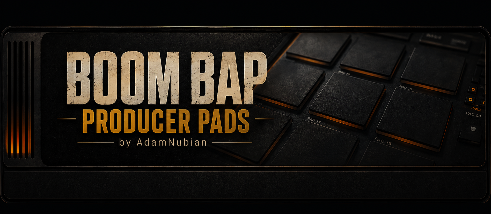

[&larr; Back to Usage overview](../../../USAGE.md) | [MIDI guides](README.md) | [INSTALL](../../../INSTALL.md) | [CHANGELOG](../../../CHANGELOG.md)

# Using a DJ controller

**In one line:** teach the plugin your DJ controller once, and its jog
wheels, buttons, faders and pads play the two decks and the pads.

Most DJ controllers only work out of the box inside the DJ app they came
with. The **DJ Controller** button on the TURNTABLE tab (and **Controller**
in the toolbar, next to **MIDI Map**) opens a window where you switch your
controller on and teach the plugin your controller yourself: it asks you
to move each control, works out what that control sends, and remembers it.
You can save the result as a named controller and it's there next time,
in the Standalone and in your DAW.

## Controllers that work straight away

Some controllers need no teaching at all. Plug one in and open the
Standalone: the plugin switches it on by itself, its buttons light up
briefly to say it's connected, and its jog, buttons, faders and pads work
at once.

| Controller | What drives what |
|---|---|
| **Dixon MID34** (Windows calls it "MIDI34") | **DECK A/B** chooses which deck the jog, **CUE**, **PLAY**, **SYNC** and the pads play (it lights up for deck 2, and deck 2 comes on screen). The jog scratches that deck (touch the top to grab the record; hold **SHIFT** to search through it quickly); turning the jog's **edge** while it plays nudges it faster or slower for a moment, to line up a beat. The side faders are the two decks' volumes, the side knobs their filters; the crossfader; **BROWSE** and **LOAD** pick files (see [Browsing from the controller](#browsing-from-the-controller)); the side buttons choose what the 8 performance pads do -- see [Pad modes](#pad-modes-dixon-mid34). |

Your own saved controller always wins: teach a built-in one differently
and save it, or pick another from **Saved controllers**. In a DAW, pick
the built-in one from **Saved controllers** yourself (the DAW, not the
plugin, decides which devices it hears).

## Pad modes (Dixon MID34)

The buttons down the sides of the MID34 choose what its 8 performance pads
do. The button of the mode you're in lights up, and so do the pads that do
something in it. Everything acts on the deck **DECK A/B** chose.

| Button | The pads | With SHIFT held |
|---|---|---|
| **SAMPLER** (where it starts) | play pads 1-8 | SHIFT + pad plays pads 9-16. SHIFT + SAMPLER switches **tempo adjust** on or off: while SAMPLER blinks, the jog changes the deck's tempo instead of moving the record |
| **HOT CUE** | jump to hot cues 1-8, or set one where the record is if it's empty (lit = set) | SHIFT + pad deletes that hot cue. SHIFT + HOT CUE = **saved loops**: an empty pad saves the running loop (or a loop from where the record is), a lit pad plays it again, SHIFT + pad clears it |
| **LOOP** | top row: loop 4, 8, 16 or 32 beats (press the lit one again to stop looping); bottom row: jump back 4 / 1, forward 1 / 4 beats | SHIFT + LOOP = **roll**: hold a pad to stutter at 1/4, 1/8, 1/16 or 1/32 |
| **STEMS** | with the record's stems (see below): top row vocals, drums, bass and other on or off, bottom row that part on its own (again: all back). Without them: the record's bass, mids and highs | SHIFT + STEMS = **beat jump**: top row back 1, 2, 4, 8 beats, bottom row forward 1, 2, 4, 8 |
| **FX ON** | Brake, Spinback, Censor (while held), Stutter (while held) | SHIFT + FX ON = **FX page 2**: Reverb, Vinyl noise, Wow/flutter, Motor ramp (each on or off), low-pass and high-pass filter (while held), Slip, Censor (while held) |
| **SCRATCH** | the six scratch patterns: Transform, Crab, Flare, Orbit, Tear, Stab; pad 7 stops a pattern | SHIFT + SCRATCH switches **Slip** on or off |
| **SYNC** | matches the deck to the project tempo | SHIFT + SYNC puts the pitch back to normal |

STEMS works with the record's real **stems** -- vocals, drums, bass and
other -- once you've split the record: press **Separate** in the deck's
Stems section on the TURNTABLE tab (see
[Stems](../turntable/turntable-tab.md#stems)). A pad is lit while its part
plays. Until the record has stems, STEMS falls back to frequency bands, the
same split the STEMS tab uses: "bass" is the low end (kick and bass line),
"mids" the middle (most vocals and melody), "highs" the top (hi-hats and
air); a switched-off band comes back at the level it had.

## Browsing from the controller

Turn **BROWSE** to move through the sample browser (on the PADS tab). Press
**LOAD** (or push BROWSE) on a folder to open or close it, and on a file to
load it: onto the selected pad on the PADS tab, or onto the controller's
deck on the TURNTABLE tab. On the TURNTABLE tab, where the browser isn't on
screen, a small note under **DJ Controller** shows the file you're on.

## The controller's lights

In the Standalone the plugin lights your controller's buttons for you,
the way DJ apps do: **Play** is lit while its deck plays, **Cue** and
**Sync** while the deck has a record, and a **pad** while it holds a
sound. When you close the plugin, the lights go off. Only buttons you've
taught (or a built-in controller's buttons) are ever lit.

## Step 1: switch your controller on

- **If the plugin can't hear it, close your DJ app.** On some Windows
  setups only one program at a time can use a MIDI device.
- **Standalone:** open the controller window (**DJ Controller** on the
  TURNTABLE tab). The top of the window lists your MIDI devices: tick your
  controller. The Standalone remembers it for next time. If it won't stay
  ticked, another program is using it: close that program and tick it
  again.
- **In a DAW:** switch the controller on in your DAW's MIDI settings and
  send it to the track the plugin is on. The plugin only hears the MIDI
  its track gets.

Then move a knob or press a button on the controller. The **Heard** line
under the devices shows the last thing the plugin received, for example
"Heard just now from MIDI34: CC 16 on channel 1". If it still says
"nothing yet", the controller's MIDI isn't reaching the plugin, and
nothing below will work until it does. **Unplug the controller and plug
it back in:** some controllers go quiet after the computer sleeps, even in
their own DJ app, and a replug wakes them. The Standalone picks it up
again by itself.

## Step 2: teach it your controller

1. In the same window, the list shows every control the
   plugin can drive: for each deck the **jog wheel**, **jog touch**,
   **Play**, **Cue**, **Sync**, **pitch fader**, **volume fader**,
   **EQ high / mid / low** and **filter**; then the **Crossfader**; then
   **Pads 1-16**.
2. Press **Learn all**. The window tells you which control to move next:
   - **buttons** (Play, Cue, Sync, pads): press it once;
   - **faders and knobs**: move it from one end to the other;
   - **jog wheels**: turn it back and forth for a couple of seconds,
     turning the top of the platter;
   - **jog touch**: touch the top of the platter, then let go.
3. When it has what it needs it says **Got it**, shows what it heard, and
   moves on by itself. A control your controller doesn't have? Press
   **Skip**. Want to stop part way? Press **Stop**. What you've learned so
   far already works.
4. Press **Save** to keep it. Give it a name first if you like (it starts
   as "My controller").

To teach or re-teach one control, select it and press **Learn** (or
double-click it). **Clear** forgets the selected control.

While the window is listening, the controller only teaches: nothing plays.
As soon as it stops listening, everything you've taught it works.
The window can stay open while you try it out: the decks and pads still
respond to your mouse and to the controller.

### Measure a jog turn

After the jog wheel is learned, press **Measure a jog turn**, put a finger
on a mark on Deck 1's platter, turn it exactly one full turn clockwise
and press **Done**. From then on one turn of your jog wheel moves the
record the same as one turn of a real 33 rpm record (1.8 seconds of
audio). Without this, the plugin uses a fixed step per tick. That still
works, but the record may move faster or slower than your hand.

## What each control does

| Control | What it does |
|---|---|
| Jog wheel | Scratches the deck. With **jog touch** learned, only a touched platter scratches, and turning the edge of the wheel does nothing. Without jog touch, turning the wheel grabs the record, and it's let go a moment after you stop turning. |
| Jog touch | Grabs the record while your hand is on the platter, and lets it go when you lift off, like holding a real one. |
| Play | Starts or stops the deck. |
| Cue | Stops the deck and jumps back to the start. |
| Sync | Matches the deck's pitch to the project tempo (the same as the deck's own Sync). |
| Pitch, Volume, EQ high/mid/low, Filter | Move the deck's own controls. |
| Crossfader | Moves the crossfader between the two decks. |
| Pads 1-16 | Play the pads exactly as a pad controller would. Velocity-sensitive pads play soft and loud, and Live Pad Quantize, Tap Pads and recording into the pattern all apply. |

The on-screen controls follow your hardware, and your DAW can record the
fader and knob moves as automation.

## Good to know

- **Two decks that send the same numbers.** Many controllers send the same
  message for both decks and only change the MIDI channel. That's fine: the
  plugin tells them apart by channel.
- **Jog wheels count in different ways.** The plugin works out which way
  your jog wheel counts while you teach it, so you don't have to know.
- **Extra-smooth faders.** Some controllers send a fader in two halves for
  finer steps (14-bit). The plugin spots this and uses both.
- **Everything else still works.** Anything the controller sends that
  you haven't taught it goes on to the plugin as usual: pad notes,
  MIDI Learn links, and the older fixed jog input (note 20 and CC 20) all
  keep working.
- **Several controllers.** Save each under its own name and pick one from
  the **Saved controllers** list. Picking one makes it live. The plugin
  remembers which one you used last. **Delete** removes the one you've
  picked (it goes to the Recycle Bin); built-in controllers can't be
  deleted.
- **Where they're kept:** `%APPDATA%\Boom Bap Producer Pads\Controllers\`,
  one `.bbcontroller` file each. Copy the file to another computer to take
  your controller setup with you.

## If something doesn't work

- **The controller did work, and now nothing reaches the plugin (or its
  own DJ app).** Unplug it and plug it back in; the Standalone picks it
  up again by itself. Some controllers (the MID34 among them) go quiet
  when Windows powers their USB port down to save energy. If it keeps
  happening, you can stop Windows doing that: in **Control Panel > Power
  Options > Change plan settings > Change advanced power settings**, set
  **USB settings > USB selective suspend setting** to **Disabled**. On a
  laptop that costs a little battery.
- **To see what the Standalone did with your controller**, open
  `%APPDATA%\Boom Bap Producer Pads\controller-log.txt`: it notes when the
  controller was switched on, when devices came and went, and (once a
  minute at most) whether anything arrived from it. If it says the
  controller was open but nothing arrived, the controller has gone quiet:
  unplug it and plug it back in.
- **"Nothing came through from the controller."** The controller's MIDI
  isn't reaching the plugin: the **Heard** line will say "nothing yet".
  Close your DJ app, then tick the controller at the top of the window
  (Standalone) or check the track's MIDI input (DAW).
- **"Couldn't switch on ..."** Another program has the controller open.
  Close VirtualDJ or any other DJ or MIDI app, then tick it again.
- **I can't find the Controller button.** It arrived in version 1.142.0.
  If your TURNTABLE tab has no **DJ Controller** button, install the
  latest version.
- **A jog wheel learned as a fader** (the record jumps instead of
  following your hand): select it, press **Learn** and turn the wheel back
  and forth, both ways, not in one long sweep.
- **The record moves too fast or too slow under your hand:** use
  **Measure a jog turn**.
- **A button does two things:** it was probably taught to two controls.
  Teaching it again to the one you want takes it off the other.

## Related guides

- [MIDI Learn](midi-learn.md): link any single knob to hardware
- [Turntable](../turntable/turntable-tab.md): the decks themselves, scratching and the crossfader
- [Pad grid](../pads/README.md): what the pads do
