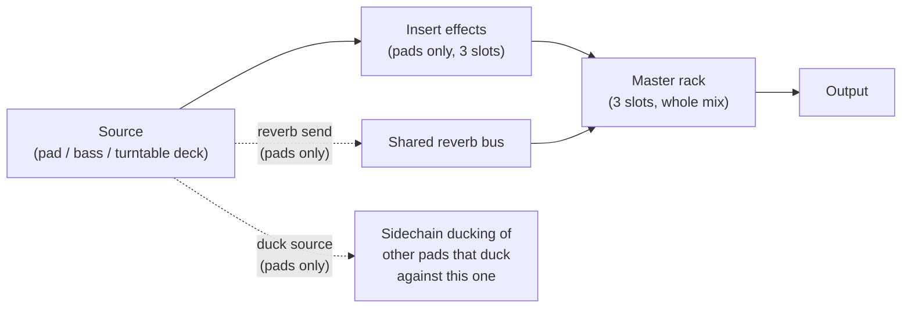

[&larr; Back to Usage overview](../../../USAGE.md) | [INSTALL](../../../INSTALL.md) | [LICENSE](../../../LICENSE.md) | [CHANGELOG](../../../CHANGELOG.md)

# MIXER tab

A console-style row of vertical channel strips — one per sound source in
the plugin (all 16 pads, the bass voice, both turntable decks), plus a
**Master** strip pinned first on the left. Everything here is the same
underlying parameters the PADS/BASS/TURNTABLE tabs already control, just
laid out side by side for a whole-kit view instead of one source at a time.

- **Solo-active banner** (above the strips) — shown whenever anything in
  the kit is soloed, so silence elsewhere in the mix reads as "something's
  soloed," not "broken."
- **Signal Flow** — opens a plain explainer of the signal path below.

## Every strip

- **Pan** knob and a vertical **Volume** fader.
- **M** / **S** — Mute and Solo, same cross-source behavior as elsewhere in
  the plugin (soloing one source silences every other un-soloed source).
- A thin peak meter down the side of the strip.

## Pad strips only

- **3 insert-effect slots** at the top — the same per-pad Insert FX chain
  from [the pad grid](../pads/pad-grid-and-browser.md)'s right-click menu, shown
  here as clickable slots instead. Picking a type here and via right-click
  on the pad are the same setting either way.
- The strip's top accent bar reflects the pad's own color tag (set via
  right-click → Color on the PADS tab) instead of a fixed color, so a
  glance across the console tells you which strips belong to which
  color-grouped pads.
- A reverb send level and a **D** (duck source) control with its own
  amount — sends this pad into a shared reverb bus, or marks it as a
  sidechain-ducking source for other pads to duck against.

## Master strip

Leftmost, always visible. Volume fader and a live peak meter — no
pan/mute/solo, since there's nothing to pan or solo on an already-summed
master bus. Its **FX** button opens the same 3-slot master rack popup as
the toolbar's own [Master FX](../toolbar/toolbar-and-presets.md) button —
one rack, two entry points.

## Bass and Turntable strips

Same Pan/Volume/Mute/Solo/meter as any strip, but no insert slots or send/
duck controls — those are pad-only features, since the bass voice and
turntable decks don't have a built-in effects-chain concept of their own.
