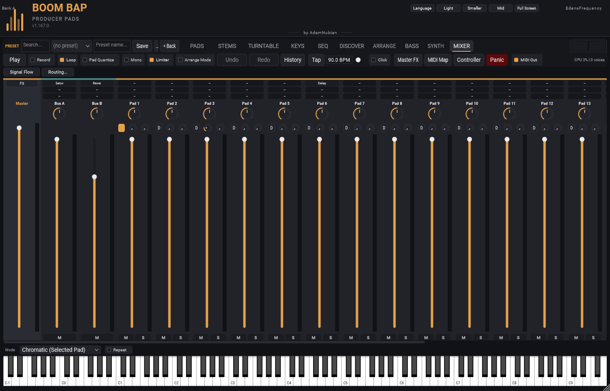
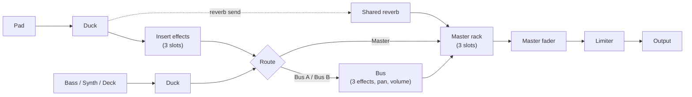
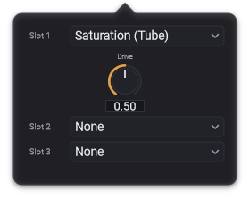
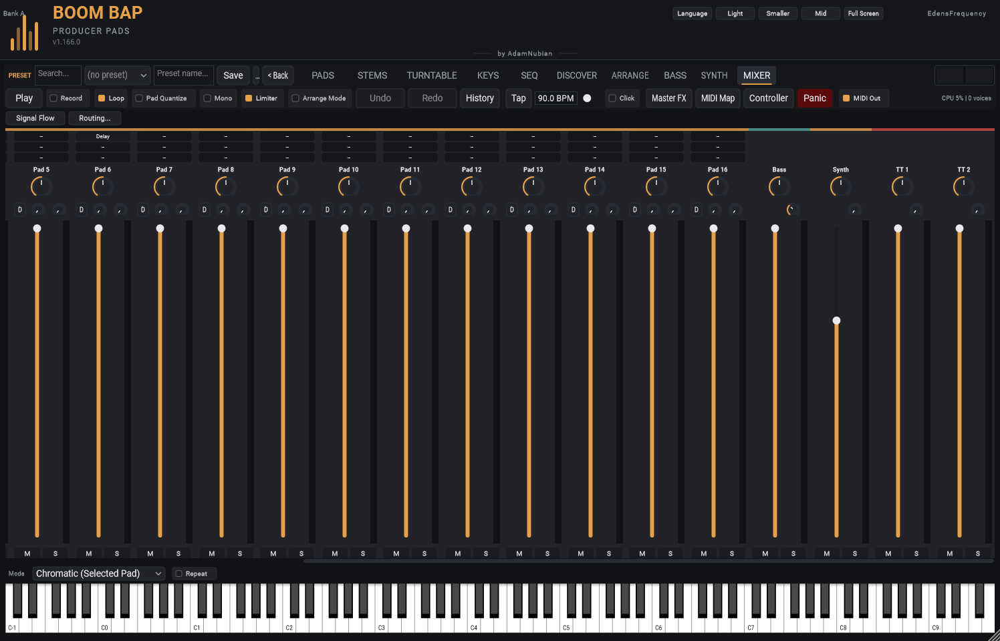
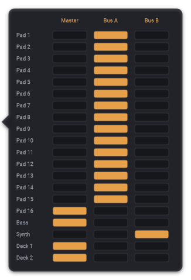

[&larr; Back to Usage overview](../../../USAGE.md) | [INSTALL](../../../INSTALL.md) | [LICENSE](../../../LICENSE.md) | [CHANGELOG](../../../CHANGELOG.md)

# MIXER tab

A console-style row of vertical channel strips — one per sound source in
the plugin (every pad in the active bank's [grid
size](../pads/pad-grid-and-browser.md), the bass, the synth and both
turntable decks), plus the **Master** strip pinned first on the left and
**Bus A** and **Bus B** beside it. Everything here is the same
underlying parameters the PADS/BASS/TURNTABLE tabs already control, just
laid out side by side for a whole-kit view instead of one source at a time.

- **Solo-active banner** (above the strips) — shown whenever anything in
  the kit is soloed, so silence elsewhere in the mix reads as "something's
  soloed," not "broken."
- **Signal Flow** — opens a plain explainer of the signal path below.

```mermaid
flowchart LR
    P["Pad"] --> PD["Duck"] --> PI["Insert effects\n(3 slots)"] --> R{"Route"}
    PD -. "reverb send" .-> RV["Shared reverb"] --> M
    S["Bass / Synth / Deck"] --> SD["Duck"] --> R
    R -- "Master" --> M["Master rack\n(3 slots)"]
    R -- "Bus A / Bus B" --> B["Bus\n(3 effects, pan, volume)"] --> M
    M --> V["Master fader"] --> L["Limiter"] --> O["Output"]
```

The **Duck** dips a source each time a pad marked **D** plays (the
sidechain pump); the duck-source pad itself never ducks.

## Every strip

- **Pan** knob and a vertical **Volume** fader.
- **M** / **S** — Mute and Solo, same cross-source behavior as elsewhere in
  the plugin (soloing one source silences every other un-soloed source).
- A thin peak meter down the side of the strip.

## Pad strips only

- **3 insert-effect slots** at the top — the same per-pad Insert FX chain
  from [the pad grid](../pads/pad-grid-and-browser.md)'s right-click menu, shown
  here as clickable slots instead. Picking a type here and via right-click
  on the pad are the same setting either way.
- The strip's top accent bar reflects the pad's own color tag (set via
  right-click → Color on the PADS tab) instead of a fixed color, so a
  glance across the console tells you which strips belong to which
  color-grouped pads.
- A reverb send level and a **D** (duck source) control with its own
  amount — sends this pad into a shared reverb bus, or marks it as a
  sidechain-ducking source for other pads to duck against.

## Master strip

Leftmost, always visible. Volume fader and a live peak meter — no
pan/mute/solo, since there's nothing to pan or solo on an already-summed
master bus. Its **FX** button opens the same 3-slot master rack popup as
the toolbar's own [Master FX](../toolbar/toolbar-and-presets.md) button —
one rack, two entry points.

## Bass, Synth and Turntable strips

At the right end of the console (scroll across to them):

Same Pan/Volume/Mute/Solo/meter as any strip, plus a **Duck** knob: how
far it dips each time a pad marked **D** (duck source, on the pad strips)
plays. Turn it up on the Bass so the 808 makes room for the kick -- the
classic sidechain pump -- or on the Synth for a pumping pad.

## Bus A and Bus B

Next to the master: two group buses. Send several sources to one bus and
treat them together -- all the drums through one saturation for glue, the
synth and a deck through a shared delay.

- **Routing...** (top left of the MIXER) shows every source -- each pad,
  the Bass, the Synth, both decks -- against **Master**, **Bus A** and
  **Bus B**. Click a cell to send that source there. Everything starts on
  the Master.
- A bus has three **insert slots** (click one for an effect; **Knobs...**
  in the same menu sets its controls), **Pan**, **Volume**, **Mute** and a
  meter. It joins the master before the master rack.
- A pad sent to its own output in your DAW (multi-out) still goes there,
  not to a bus.
- **Export WAV** and **Export Full Song** render the mix the way you
  hear it: each pad's effects, sends and Duck, the buses, the master rack,
  the Master fader and the safety limiter.
