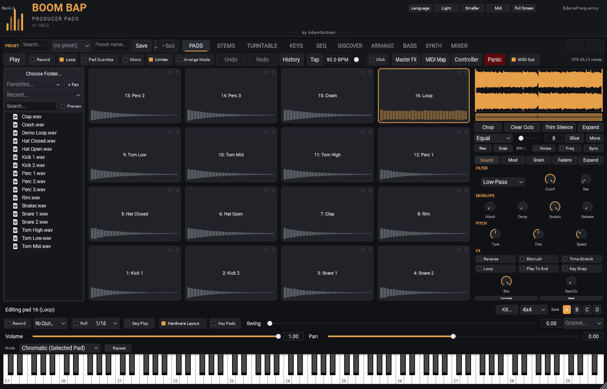
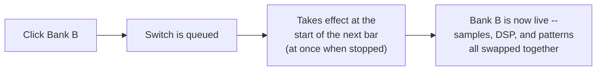

[&larr; Back to Usage overview](../../../USAGE.md) | [INSTALL](../../../INSTALL.md) | [LICENSE](../../../LICENSE.md) | [CHANGELOG](../../../CHANGELOG.md)

# The pad grid & sample browser

This is the main PADS view: sample browser on the left, the 4x4 pad grid in
the middle, and the waveform/DSP column on the right, with the performance
controls along the bottom and the keyboard under everything.

## Sample browser

Top-left panel.

- **Choose Folder...** — point the browser at your own sample library.
  Remembered across sessions.
- **Search** box — filters the visible tree by filename (case-insensitive
  substring match). Folders you already had open keep showing what they
  last scanned until you collapse and reopen them; newly opened folders
  always reflect the current search.
- **Double-click a file** to load it onto whichever pad is currently
  selected.
- Dragging a file *out of* this browser and onto a pad isn't supported yet
  — drag from Windows Explorer or your DAW's own browser instead (see
  below), or double-click.

### Dropping files anywhere

Drag audio or video from Windows Explorer (or your DAW's browser) onto:

- **a pad** — loads it onto that pad;
- **the Sample Editor** — loads it onto the pad it's showing;
- **the deck** (TURNTABLE) or the **bass lane** — loads it there;
- **the DISCOVER crate** — adds it (a folder adds its audio and video);
- **anywhere else** — a menu asks what to do with it: load it onto the
  selected pad, onto the next empty pad (several files: onto empty pads in
  order), send it to the deck, add it to the DISCOVER crate, or **match the
  project tempo to it** (sets the tempo from the file's detected BPM).

## The pad grid

16 pads. By default they're laid out bottom-left to top-right (pad 1
bottom-left, pad 16 top-right), matching how many hardware pad
controllers number their physical pads — so the pad you see selected is
the pad you actually hit. Click **Hardware Layout** in the toolbar to
switch back to plain top-left-to-bottom-right reading order.
Either way, the underlying MIDI note mapping is unchanged (notes 36–51
always trigger pads 1–16 in the same order) — this only affects which
grid cell each pad's box is drawn in.

Each pad plays one sample, one-shot (it always plays from the
start of its region; triggering it again while it's still playing cuts the
previous hit and restarts — different pads never cut each other off,
unless **Mono** mode is on — see [The toolbar](../toolbar/toolbar-and-presets.md)).

- **Key Pads** (next to Hardware Layout) — play the pads from your
  computer keyboard. The keys are laid out like the pads on screen:

  | Hardware Layout on | Hardware Layout off |
  |---|---|
  | `1 2 3 4` = pads 13-16 | `1 2 3 4` = pads 1-4 |
  | `Q W E R` = pads 9-12 | `Q W E R` = pads 5-8 |
  | `A S D F` = pads 5-8 | `A S D F` = pads 9-12 |
  | `Z X C V` = pads 1-4 | `Z X C V` = pads 13-16 |

  Hold **Shift** to play softer. On a bigger grid the keys cover the
  first 16 pads' corner of it. It works on every tab except TURNTABLE
  (whose letters chop the record), so you can play pads while you're on
  SEQ, KEYS, SYNTH and the rest. While Key Pads is on, **E** plays a pad
  instead of resizing the Sample Editor (use its Expand button), and
  typing in a text box still types. It's remembered for next time.
- **Keyboard and screen readers.** **Tab** moves through the controls;
  on a pad, **Space** or **Return** plays it and **Shift+F10** opens its
  menu. Screen readers (Narrator, NVDA) read each pad as "Pad 3: <its
  sample>", and each knob, fader and dropdown by its name ("Cutoff",
  "Pad 3 volume", "Grid size").
- **Click an empty pad** — opens a file chooser to load a sample onto it.
- **Click a loaded pad** — selects it (highlights gold) and triggers it
  (flashes, and glows orange while the sample is still playing).
- **Quick Stop** — a small stop icon appears in the top-left corner of any
  pad that's currently playing (it takes over the Choke Group letter
  badge's spot, which comes back once playback stops). Click it to cut
  the pad off right away instead of waiting for a long sample to finish.
- **Drag an audio file onto any pad** — loads it directly, from Windows
  Explorer or your DAW's own sample browser if it supports OS-level
  drag-and-drop.
- **Drag a loaded pad's sample out** (past a small threshold) — exports its
  current region to a temp WAV and starts a real file drag: drop it onto
  another pad to copy the sample there, or drop it into your DAW's own
  browser/playlist to pull it out of the plugin entirely.
- **Right-click any pad** — Load Sample… / Clear / Rename…, **Send to the
  deck** (to chop it again on the TURNTABLE tab, as it is or as it sounds --
  see [Chop a pad again](../turntable/turntable-tab.md#chop-a-pad-again)), plus Choke
  Group, **Layers** (see below), Color, and three **Insert FX** submenus (Insert FX 1/2/3 — up to
  3 effects in series on that pad). Each slot can hold Chorus, Flanger,
  Phaser, Transient Designer, Harmonic Exciter, Stereo Doubler, Reverb,
  Delay, one of 3 Saturation flavors (Tube, Transformer, Console), or
  Formant Shift ("None" is the default — sounds exactly like it always
  did). Reverb, Delay, Saturation, and Formant Shift slots also get an
  "Edit Knobs…" option in that same submenu for adjusting their parameters (Size/Damping/Mix,
  Time/Feedback/Mix, Drive, or Shift).
- **Key Shift Pad** (right-click menu, on a loaded pad) — spreads that
  pad's sample across your other empty pads, each one a semitone higher
  than the last. Turns one chop into a playable chromatic instrument
  across the grid, without needing the KEYS tab.
- **Layers** (right-click menu) — makes this pad play one of several
  pads each time it's hit. That's how you get drums that don't sound
  machine-gunned, and hits that change character with how hard you play.
  Load the variations onto pads next to each other, right-click the first
  one and pick:
  - **Velocity layers:** soft hits play the first pad, harder hits the
    next ones, the hardest hits the last one. Load them softest first.
  - **Round robin:** each hit plays the next pad in turn.
  - **Random:** each hit plays one of them at random, never the same one
    twice in a row.

  Then choose how many pads (this pad and up to 7 after it). If you've
  batch-selected pads (Ctrl+click), you can also build the group from those.
  The pad you right-clicked shows **VEL**, **RR** or **RND** and the count
  in its corner; the others show **in N** (the pad that plays them). They
  all stay normal pads with their own chop, envelope and effects, and you
  can still play or program them on their own. Program the pattern on the
  first pad and the variations happen by themselves, in the bounce too.
  **Off** undoes it. A pad can only be in one group.
- **Favorite** (right-click menu) — protects this pad's step pattern from
  Randomize and Flip the Sample (see [Step
  sequencer](../step-sequencer/step-sequencer-and-roll.md)) — shown with a small gold star.
- Supported file types: `.wav`, `.aif`/`.aiff`, `.flac`, `.ogg`, `.mp3`,
  `.m4a`/`.aac`, `.wma` — and videos (`.mp4`, `.mov`, `.mkv`, `.avi`,
  `.wmv`, `.webm`, `.m4v`, `.3gp`, `.mpg`), which load their soundtrack.
  See [DISCOVER → using videos](../discover/discover-tab.md#local-files)
  for what Windows can decode and the 20-minute limit.

Pads also respond to MIDI: notes 36–51 (C1 upward) trigger pads 1–16 with
real velocity sensitivity from your MIDI controller/keyboard. Clicking a pad
in the UI always triggers at a fixed velocity.

**Bank A / B / C / D** buttons (right under the grid, next to "Editing pad
N" — also available on the SEQ tab) switch between 4 complete kits — 4
banks x 16 pads = 64 addressable pad slots in total.
Switching banks swaps *everything*: every pad's sample, every DSP setting,
and every pattern, all together, so each bank is a genuinely separate kit
rather than just an alternate pattern for the same 16 samples. A bank
switch is bar-quantized — while the song is playing it takes effect at the
start of the next bar, not the instant you click, so it never chops a
pattern off mid-phrase. While it's stopped, it switches straight away.

**Grid size** dropdown (next to the Bank buttons) — each bank can be its
own size: 4x4 (16 pads, the default), 5x5 (25), 6x6 (36), 7x7 (49), or
8x8 (64). Picking a bigger size adds more pads to the grid immediately —
the pads themselves get smaller to fit the same space, the plugin window
doesn't grow. This applies to whichever bank is currently active and
takes effect right away, unlike Bank switching itself (no bar-quantize
wait — there's no audio content to keep in sync, just how many pads are
addressable). Every other bank keeps its own independently-set size, so
Bank A can stay a compact 4x4 while Bank B runs a full 8x8. The
SEQ/KEYS/DISCOVER tabs and MIDI note range all follow whichever size the
active bank is currently set to; see [Output
routing](../dsp-controls/dsp-controls.md) for the one thing that's capped
at 16 regardless of grid size.

**Kit...** (just left of the Grid size dropdown) exports the active bank
as a SoundFont, SFZ, DecentSampler preset, sliced WAV or a whole FL
Studio pack, and imports kits from those formats or a folder of samples.
See [Kit import & export](kit-import-export.md).
