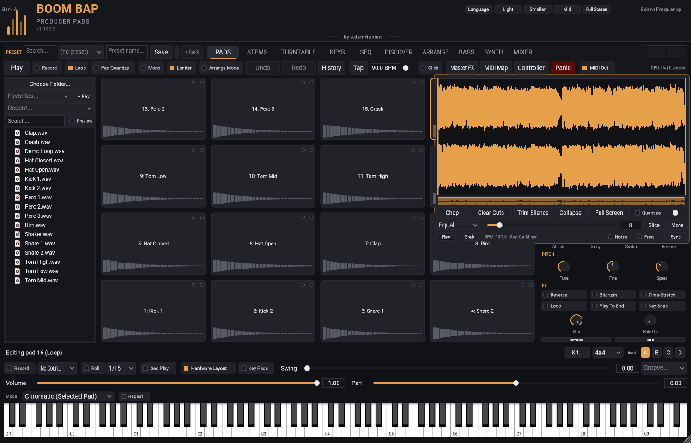

[&larr; Back to Usage overview](../../../USAGE.md) | [INSTALL](../../../INSTALL.md) | [LICENSE](../../../LICENSE.md) | [CHANGELOG](../../../CHANGELOG.md)

# Sample editor

Top-right panel of the PADS tab — shows the waveform of whichever pad is
currently selected.

- **Expand** / **Full Screen** — make the waveform bigger: Expand takes
  over the sound controls' space, Full Screen the whole tab. **E** steps
  through Normal, Expanded and Full Screen; **Escape** goes back to Normal.

- **Trim handles** (the two vertical orange bars) — drag to set the region
  the pad actually plays. Everything outside the region is dimmed.
- **Click inside the waveform** — drops a cyan cut-point marker.
- **Chop** — splits the current region at every cut-point marker you've
  placed, and assigns the resulting slices to this pad and the pads after
  it (up to the last pad of the grid — slices never wrap back around).
- **Clear Cuts** — removes any pending cut-point markers without chopping.

## Slice

The row under Chop cuts the region for you. Pick a **mode**, set its
amount with the slider, and press **Slice**: slice 1 stays on this pad,
the rest go on the pads after it. **Undo** puts it back.

| Mode | The slider sets | What it does |
|---|---|---|
| **Equal** | how many slices (2-64) | Cuts the region into equal pieces. |
| **Transients** | sensitivity | Cuts at every hit. Low sensitivity keeps only the big hits (kick, snare); high catches the quiet ones too (ghost notes, hats). |
| **Beat grid** | slice length: 1 bar, 1/2 bar, 1 beat, 1/8, 1/16 | Cuts on the beat, from the sample's detected tempo, lined up with its first hit. Each line settles onto a hit that's close by, so a played loop still cuts on its real hits. |
| **Find chops** | how many chops (2-32) | Picks strong hits that start a phrase (on the beat, especially the one) and makes a chop from each to the next, at most two bars long. The quick way to pull the best parts out of a loop. |
| **Random** | how many slices | Cuts at random points (nudged onto nearby hits). Press again for a different set. |

- If there are more slices than pads left, the rest are skipped and a
  message by the Slice button says how many. Pick a bigger Grid Size, or
  slice from an earlier pad.
- **Beat grid** needs a tempo. If none was detected in the sample, it
  estimates one from the region, and failing that uses your project's
  tempo (the message says so).
- Cuts are placed a hair before each hit so the attack is never shaved
  off, and every slice fades in and out over a millisecond or so at the
  points where it was cut — no clicks, even cutting through a held note.
  A pad playing a whole sample keeps its instant attack.
- To reverse one slice, select its pad and turn on **Reverse** in the
  sound controls — each slice is its own pad.
- **More** has two extras:
  - **Slice into the next empty bank:** the same slices, but onto pads
    1 onward of the next bank that has no sounds and no pattern. The
    plugin switches to that bank, and your current kit isn't touched. While
    the song is playing, the switch (and the slices) happen at the start
    of the next bar. Undo takes the slices back.
  - **Save slices as MIDI...:** saves this pad's slices as a MIDI file that
    plays them in their original order and timing. Drag it into your DAW
    and the loop plays back from the pads, ready to rearrange.
- **Quantize** toggle — when on, placing a cut point or dragging a trim
  handle snaps to the nearest beat-grid line (shown as faint vertical
  lines once a tempo is detected) instead of the exact pixel you clicked.
  With no detected tempo, it snaps to the nearest transient instead.
- **Trim Silence** — trims leading and trailing silence (below roughly
  -48dBFS) from the current region automatically. Only scans within the
  region you've already set, so running it again after a manual trim
  narrows further rather than re-scanning material you already cut away.
- **BPM / Key** readout — automatically detected when you load a sample
  (shows `--` for either if nothing could be estimated — a one-shot hit
  with no discernible tempo, for example). **Sync** sets this pad's Speed
  so its detected BPM matches your host's current tempo, one click.
- **Freq** toggle — switches the waveform from the plain gold colour to a
  tint by frequency content (bass-heavy = red, treble-heavy = blue), so
  you can spot where the low end and the brighter transients sit at a
  glance.
- **Zoom slider** — 0 (fully zoomed out) to fully zoomed in.
- **Ctrl+scroll** on the waveform — zooms in/out anchored to wherever your
  cursor is, like a code editor. Plain scroll (no ctrl) pans left/right
  once you're zoomed in.

## Recording into a pad

**Rec** (bottom left of the Sample Editor) records your audio input
straight onto the selected pad: a vocal, a guitar, a record playing on a
real turntable, anything coming into your computer.

1. **Turn the input on** (once):
   - **Standalone:** choose your microphone or audio interface as the
     input in the audio settings. If there's no input yet, Rec offers to
     open them; you can also right-click Rec. The little meter beside Rec
     moves when sound is coming in.
   - **In a DAW:** send a track, or your interface's input, to Boom Bap
     Producer Pads' **sidechain input**. Every DAW does this a little
     differently; look for "sidechain" in the plugin's routing. The input
     stays off until you do, so nothing changes for projects that don't
     use it.
2. **Press Rec.** It says *Waiting for sound...* and starts recording the
   moment sound comes in, keeping a few milliseconds from just before so
   the attack isn't cut off. Right-click Rec and pick **Start straight
   away** to record from the moment you press it instead.
3. **Press Stop** when you're done (or **Cancel** while it's still
   waiting). Recordings stop by themselves after 2 minutes.

The take is saved as a WAV in your **Music\Boom Bap Recordings** folder
(named after the pad and the time) and loaded onto the pad it was armed
on, so your project, presets and kits keep it like any other sample.
Right-click Rec → **Open the recordings folder** to find them. What's
coming in is never played through the plugin, so you won't hear it twice
(or get feedback) while recording.

## Grab: the last few seconds, onto a pad

**Grab** (next to Rec) is always listening. Press it and the last 30
seconds -- of whatever the plugin has been playing -- go onto the selected
pad, the quiet bits at either end trimmed off. Nothing to arm, nothing to
miss: play around until something sounds good, then Grab it.

- It's **resampling** in one click: jam a beat, Grab it, chop it on the pad
  or send it to the deck (pad menu), and build on it.
- **Right-click Grab** for the length (the last **10**, **20** or **30**
  seconds), what it keeps -- **what's playing** (the default) or **the
  audio input** (set up as for Rec, above) -- and **Open the captures
  folder**.
- Grabs are saved as WAVs in **Music\Boom Bap Captures** and loaded onto
  the pad like any sample, so your project keeps them.
- Switching what it keeps starts the listening afresh.
