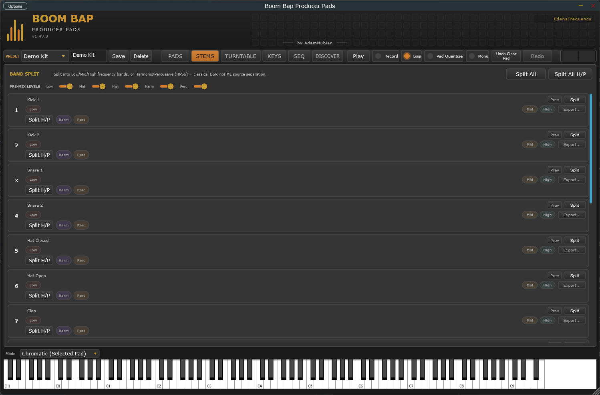

[&larr; Back to Usage overview](../../../USAGE.md) | [INSTALL](../../../INSTALL.md) | [LICENSE](../../../LICENSE.md) | [CHANGELOG](../../../CHANGELOG.md)

# STEMS tab

Splits a pad's sample into three frequency bands — **Low / Mid / High** —
using filters. This is **not** AI/ML source separation: it can't cleanly
pull an isolated vocal, drum, or bass part out of a full mix, since it only
splits by frequency, not by instrument. It's most useful for pulling apart
the tonal range of a single one-shot, not remixing a full song.

- **Format: WAV / AIFF** (top right) — which format Split and Export...
  write. Changing it only affects files written from now on — anything
  already split stays in whatever format it was written in.
- **Split** (per pad row) — splits that pad's currently-loaded sample,
  writing three files (`..._Low`, `..._Mid`, `..._High`, extension per
  the Format choice above) into a `Stems` subfolder next to the original
  sample file.
- **Split All** — runs Split on every pad that currently has a sample
  loaded.
- After a successful split, three small chips appear per row (**Low / Mid
  / High**) — **drag any chip** straight into your DAW's playlist/browser
  to pull that band in directly, or click **Export...** to copy all three
  to a folder of your choice.
- **Split H/P** / **Split All H/P** — a second, independent split into
  **Harmonic** (sustained/tonal content) and **Percussive** (transient/
  drum-hit content), writing `..._Harmonic`/`..._Percussive` (same Format
  choice) into the same `Stems` folder. Also classical DSP, not AI/ML — and still not
  a replacement for the Low/Mid/High split above, you can run both on the
  same pad. Works best on material with real sustain (chords, vocal
  chops, pads); on pure drum breaks the two won't separate as cleanly.
- **Right-click any chip** for "Send to next empty pad" — loads that
  stem straight onto the next pad with nothing on it, no manual
  drag-and-drop needed.
- If you load a different sample onto a pad after splitting, that row's
  chips and Export button reset — they only ever point at bands/stems
  that actually match what's currently loaded.

## Pre-mix levels & live preview

Five sliders (**Low / Mid / High / Harm / Perc**) sit above the pad list —
real, host-automatable parameters, one per stem type, shared across every
pad (only one pad's stems are ever being previewed or exported at a time,
so there's one set of levels rather than a separate five per pad). They
default to 100%.

- Each pad row has a small **Prev** button (next to Split) once that row
  has been split — click it to audition that row's stems mixed live at
  the current slider levels; it turns into **Stop** while playing.
- Adjust the sliders while previewing to hear the balance change live.
- **Export** now bakes the current levels into the files it writes — a
  stem left at 100% is untouched (identical to before this existed), but
  dial one down and the exported WAV comes out quieter, letting you
  balance stems by ear before committing to files.
