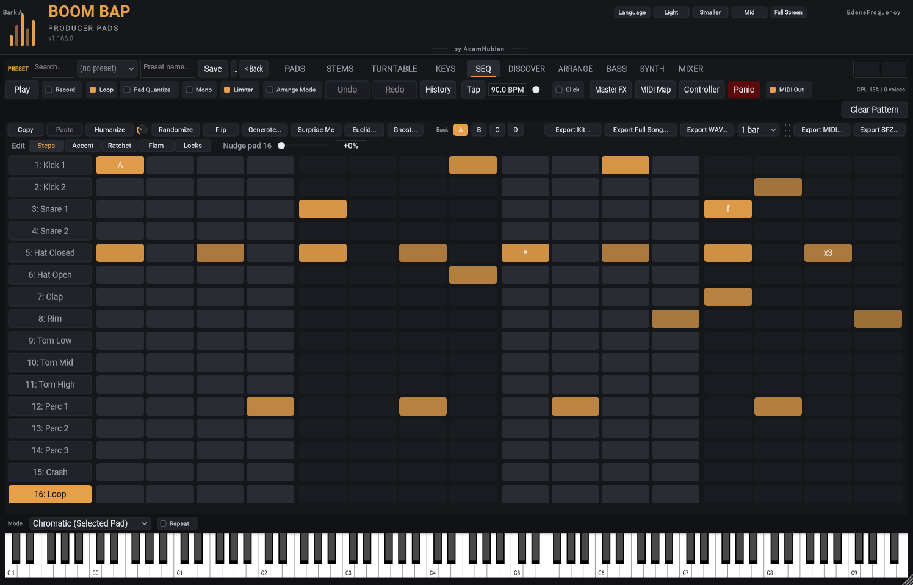

[&larr; Back to Usage overview](../../../USAGE.md) | [INSTALL](../../../INSTALL.md) | [LICENSE](../../../LICENSE.md) | [CHANGELOG](../../../CHANGELOG.md)
<hr>


<hr>


# Step sequencer & Roll



## Step sequencer

SEQ tab. The whole beat in one grid: a row for every pad in the active
bank (its number and name on the left), across the 16 steps of one bar of
4/4, grouped by beat in shaded blocks of 4.

- **Click a pad's name** to select that pad. The tools that work on one
  pad (Copy / Paste, Humanize, Randomize, Clear Pattern, Nudge) use the
  selected pad; it's the same selection as on the PADS tab.
- **Click a step** on any row to toggle it on/off.
- **Scroll on a lit step** to adjust its velocity; **Shift+scroll** to
  adjust its trigger probability (shown as a % on the step once it's
  below 100 — a step at less than 100% has a chance of skipping each
  time round, for evolving/generative patterns).
- **Copy / Paste** — copy the selected pad's whole pattern (steps,
  pitch, length, velocity, probability) and paste it onto another pad.
- **Humanize** nudges the velocity of already-lit steps a little, for a
  less mechanical feel. **Randomize** regenerates which steps are on/off
  at roughly the same density as before — the two compose (Randomize
  first, then Humanize the result, or either alone). **Flip** generates
  a fresh pattern across every pad that's a slice of the same chop as
  the selected pad — a quick way to hear a chopped loop rearranged.
  Right-click a pad and choose **Favorite** to protect its pattern from
  both Randomize and Flip — a favorited pad (shown with a small gold
  star) keeps its pattern exactly while everything else changes around
  it, so you can lock in a part you like and keep regenerating the rest.
- **Generate...** builds a whole drum pattern across several pads at
  once from a genre template — different from Randomize/Flip, which
  each work on one pad's existing pattern. Opens a small popup:

  ```mermaid
  flowchart TD
      A["Click Generate..."] --> B["Assign pads to roles:\nKick / Snare / Closed Hat / Open Hat\n(auto-guessed from pad names,\nany role can be left blank)"]
      B --> C["Pick a genre template — or let it\nauto-suggest one from the Kick\npad's detected tempo"]
      C --> D["Click Generate"]
      D --> E["Each assigned pad's pattern\nis replaced with that role's part\n(favorited pads are skipped)"]
  ```

  - Roles left as **(none)** are skipped — you don't have to fill in
    all four, e.g. assign just Kick + Snare and leave the hats alone.
  - A pad named something like "Kick 1.wav" gets auto-selected for the
    Kick role (matched by name, e.g. "kick"/"bd", "snare"/"sd", and
    similar hints for the hats) — always changeable, never required.
  - 8 genre templates: Boom Bap, Trap, House, Dembow, Halftime,
    Afrobeats, Drill, Lo-Fi — each a different kick/snare/hat feel.
  - The Template dropdown auto-suggests whichever template best matches
    the Kick pad's detected tempo (closest match if none fits exactly)
    — a starting point, always changeable.
  - Generate **replaces** each assigned pad's whole pattern (not a
    merge) — same one-undo-snapshot safety net as Randomize/Flip, so
    Undo gets you back if you don't like the result.
  - Favorited pads are protected here too, same as Randomize/Flip.
- **Export WAV...** renders the current pattern (1-8 bars, the length
  beside it) to a WAV file, and **Export Full Song** the whole
  arrangement. Both are the whole mix as you hear it: the pads, the bass
  and the KEYS synth part, with their effects, sends, Duck and buses, and
  the master's effects, fader and limiter. A pattern's reverb and delay
  tails wrap round to its start, so the file loops cleanly; a song's ring
  out at the end.
- **Export SFZ...** exports the current kit (every loaded pad's trimmed
  sample + volume/pan/tuning/ADSR/reverse, Play To End or Loop, and choke
  groups) as an SFZ instrument you can load in any SFZ-compatible sampler
  outside this plugin. More formats (SoundFont, DecentSampler, sliced WAV,
  an FL Studio pack) and kit import are on the PADS tab's **Kit...** button
  -- see [Kit import & export](../pads/kit-import-export.md).
- **Clear Pattern** wipes the selected pad's steps.
- **Swing** delays every second step slightly, for a less mechanical feel.
- **Volume** — persistent per-pad level, audible immediately even on a
  currently-playing pad (separate from the transient per-hit velocity).
- **Pad Quantize** (toolbar) — a *live-triggered* hit (real MIDI or a
  click) waits for the next beat instead of firing instantly; sequencer
  steps are unaffected, they're already on the grid. See [The
  toolbar](../toolbar/toolbar-and-presets.md).
- The sequencer follows your DAW's transport and tempo — press play in
  your DAW, not in the plugin. (Running the plugin standalone, without a
  DAW, is different — see [Saving your work & running
  standalone](../../saving-and-standalone.md).)
- Whatever's actually playing here (and on the BASS lane) can also be sent
  out live as real MIDI, in addition to triggering this plugin's own
  audio — see the toolbar's [MIDI Out toggle](../toolbar/toolbar-and-presets.md).

Each pad has its own row and its own pattern, so you build the whole beat
in one view.

**Bank A / B / C / D** buttons switch between 4 complete kits — see [The
pad grid & sample browser](../pads/pad-grid-and-browser.md) for what a bank
switch carries with it.

## Drum groove: accent, ratchet, flam, nudge and locks

The row under the SEQ buttons sets what a click on a step does -- **Edit**:

- **Steps** (the usual): a click turns a step on or off.
- **Accent**: a click makes the step louder (marked **A**), or back.
- **Ratchet**: each click plays the step 2, 3 or 4 times inside its own
  16th (marked **x2**-**x4**), then back to once -- rolls and stutters on
  hats and snares.
- **Flam**: a click adds a soft grace hit just before the step's hit
  (marked **f**), the way a drummer flams a snare.
- **Locks**: a click picks the step; then give that one step its own
  **Pan**, **Filter** cutoff and **Start** (how far into the slice it
  begins) -- marked **\***. A hi-hat that opens up on the last step, a
  snare that hits from the middle of its sample, a kick panned for one hit.
  **Clear locks** puts the step back to the pad's own settings. A lock lasts
  until that pad's next hit; playing the pad live always uses its knobs.

In any mode but Steps, clicking a step that's off turns it on with that
change. The marks show on the steps (and the chance, if it's under 100%).

**Nudge pad N** (on the right when Edit isn't Locks): plays the selected
pad a little late, up to half a 16th -- the laid-back snare that drags
behind the beat. Each pad has its own; it's saved with the kit.

All of it is saved with the pattern and its bank, copied by **Copy** /
**Paste**, taken back by Undo, and heard the same in **Export WAV**.
Variations of a pattern are the banks (**A**-**D**); to chain them into a
longer section, use the **ARRANGE** tab.

## Roll / note-repeat

**Roll** toggle + rate dropdown (1/8, 1/16, 1/32), next to Clear Pattern.
Turn it on, then press and hold any loaded pad — it auto-retriggers at the
selected subdivision for as long as you hold it, free-running from your
DAW's current tempo. Release to stop. While Roll is on, dragging a pad
(the sample-export gesture on the [pad grid](../pads/pad-grid-and-browser.md)) is
disabled to avoid the two gestures colliding.
