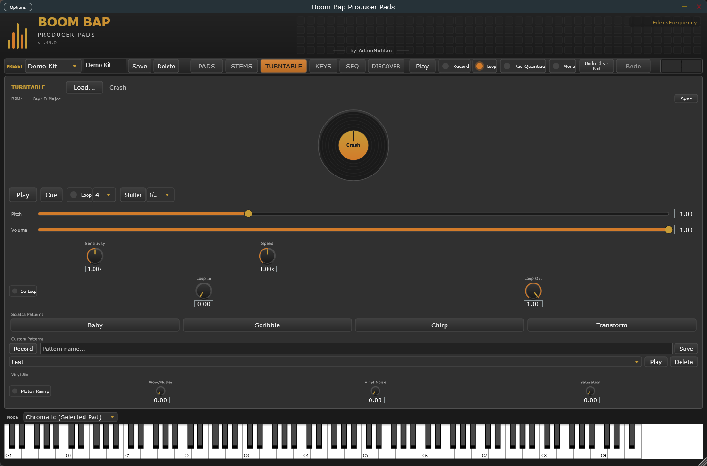
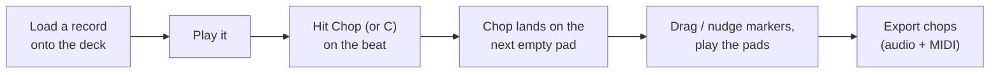
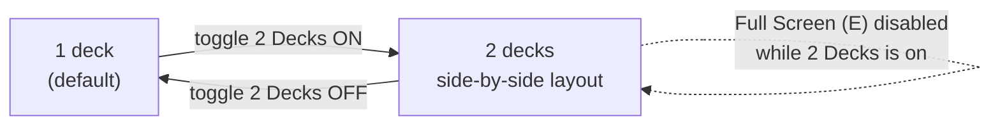

[&larr; Back to Usage overview](../../../USAGE.md) | [INSTALL](../../../INSTALL.md) | [LICENSE](../../../LICENSE.md) | [CHANGELOG](../../../CHANGELOG.md)

# TURNTABLE tab

One dedicated deck with its own sample slot, not tied to pad selection.
The platter sits on the left at a much larger size than other tabs'
controls; everything else lives in a scrollable strip on the right, and
the **Chop** lane runs along the bottom (see [Deck Chop](#deck-chop)
below): it chops whatever's on the deck straight onto your pads.

- **Full Screen** (or press **E**) — hides everything but the platter
  and a small Play/Cue strip, for an uncluttered view while performing.
  Press **Escape**, or click the button again, to return.

- **Load...** or **drag an audio file** onto the panel to load a sample
  onto the deck. A **video** works too: its soundtrack loads like any
  record (also from DISCOVER's **Send to Deck**).
- **Click-drag the platter** to scratch: dragging clockwise plays forward,
  counter-clockwise reverses, and the pitch follows how fast you drag.
  Release to resume normal playback from wherever the scratch left off.
- **Play / Pause** — normal playback at the current pitch.
- **Cue** — stops and jumps back to the start.
- **Pitch** fader — 0.5x–2.0x playback speed when not scratching.
- **Volume** fader — deck output level.
- **EQ / Filter / Reverb** — Low/Mid/High EQ (±24dB), a Filter knob
  (sweeps low-pass to high-pass through a neutral centre), and a Reverb
  send, all real host-automatable parameters.
- **Loop** — repeats a beat-length region from wherever playback
  currently is (needs a detected BPM, see the BPM/Key readout).
- **Stutter** — hold-to-engage rapid retrigger of a short slice, rate
  selectable (1/4 to 1/32).
- **Scratch Patterns** — Baby/Scribble/Chirp presets replay a canned
  scratch gesture; **Record** captures your own platter moves as a named
  custom pattern to replay later. The fader-work patterns are under
  [Perform](#perform) below.
- **Vinyl Sim** — Wow/Flutter, Vinyl Noise, and Saturation knobs (0–100%,
  no effect at 0) plus a **Motor Ramp** toggle (spins up to speed from a
  stop instead of starting instantly). All off by default.

## Perform

DJ moves, in the control column under Scratch Patterns (scroll down to
see them). They run inside the audio engine, so a fader click lands
exactly where it should, and the patterns follow your **project tempo**.

**Scratch patterns with the fader** — each plays one bar: a hand
rocking the record plus a crossfader cutting the sound, then the record
is back exactly where it started.

| Pattern | What it sounds like |
|---|---|
| **Transform** | The sound chopped into four quick stabs every beat while the record rocks back and forth |
| **Crab** | Four very fast taps on each push of the record |
| **Flare** | Each push starts open and is clicked off once in the middle — two sounds per push |
| **Orbit** | A flare on the push *and* on the pull |
| **Tear** | The push stalls halfway, splitting it into two sounds, with the fader open |
| **Stab** | A quick hard push with the sound cut right after the attack |

The running pattern's button lights orange.

- **Brake** — the record slows to a stop, like hitting stop on a real
  turntable. (Scratch Speed sets how long it takes.)
- **Spinback** — throws the record backwards, then it stops.
- **Censor** — hold it and the playing record runs backwards; let go
  and it plays forward again.
- **Slip** — turn it on and scratching, Censor, Stutter, Loop and the
  patterns all happen *over* the record without moving it: a silent
  playhead keeps going underneath, and when you let go the record jumps
  to where it would have been. Your scratch stays in time with the beat.
- **Hot cues 1–8** — click an empty one to mark the playhead there
  (it turns gold); click a gold one to jump to it and play. Shift+click
  clears it. Jumps fade out and in over about a millisecond, so they
  don't click. Cues are saved with your project, and cleared when you
  load a different record.
- **< and >** — jump back or forward by the amount in the box (1 beat
  up to 4 bars), using the record's tempo.

### Stems

**Stems** splits the record on the deck into its **vocals**, **drums**,
**bass** and **other** (everything else: keys, guitars, strings), so you
can drop the vocal out, play only the drums, or bring the bass back in on
the one.

1. The first time, press **Get separator**. It downloads the separator
   (about 250 MB, once): HT-Demucs, the separation model, and ONNX Runtime,
   which runs it. Everything then runs on your computer: there's no
   account or key, and your music is never uploaded.
2. Load a record and press **Separate**. Splitting takes a while -- on a
   typical laptop about twice as long as the record lasts, so a 4-minute
   record takes about 8 minutes. The deck keeps playing while it works,
   and **Cancel** stops it. The result is
   kept, so the next time you load that record its stems are ready
   straight away.
3. Click **Vocals**, **Drums**, **Bass** or **Other** to switch that part
   on or off (gold = on). Shift+click plays that part on its own;
   Shift+click it again to bring them all back. Parts fade in and out
   over a few milliseconds, so they don't click.

With every part on, you hear the original record, untouched. Scratching,
loops, hot cues, Slip and the patterns all work on the stems too. Stems
are separated per deck, and a record's stems are kept in
`%APPDATA%\Boom Bap Producer Pads\Stems` (delete that folder to free the
space; the plugin makes them again when asked).

On a DJ controller, the **STEMS** pads work the stems once a record has
them: see [Pad modes](../midi/dj-controller.md#pad-modes-dixon-mid34).

The platter also responds to an external MIDI jog-wheel controller, not
just mouse drag: Note On/Off at note 20 touches/releases the platter, and
CC 20 carries relative jog motion (the standard sign-magnitude relative-
encoder convention most DJ jog wheels already speak) — both on MIDI
channel 1. Useful if you're driving this from a hardware controller or a
DAW MIDI script rather than the mouse.

**A real DJ controller:** press **DJ Controller** (top left of this tab),
switch your controller on, and teach the plugin its jog wheels,
Play/Cue/Sync, faders, EQ, crossfader and pads: both decks follow it. See
[Using a DJ controller](../midi/dj-controller.md).

## Deck Chop

Chop a record the way you'd do it on hardware: put it on the deck, play
it, and hit a button on the beat. Every chop lands on a pad straight away
and is playable immediately. There's no separate "commit" step, because
the markers on the waveform **are** the pads: move a marker and its pad
changes with it.

- **Chop** (or press **C**) — drops a chop at the playhead onto the
  lowest-numbered empty pad of the current bank. Works while the record
  plays (chop by ear) or while it's paused (chop exactly where you
  stopped). **Double-click** anywhere on the waveform to chop at that
  point instead.
- **Auto...** — chops the whole record for you, onto the empty pads:
  *Every hit*, *Only the big hits*, *Every bar*, *Every beat* (from the
  record's tempo, settling onto its real hits), *8* or *16 chops* (strong
  phrase starts, on the beat first), or *8 random chops*. One Ctrl+Z
  takes the whole lot back. These are the same slice modes as the
  Sample Editor's [Slice](../sample-editor/sample-editor.md#slice) row.
  **Into the next empty bank** has the same choices, but chops into a
  fresh bank (one with no sounds and no pattern) and switches to it, so
  your current kit stays as it is.
- **The mini pad grid** (right of the waveform) shows the current bank:
  gold pads are chops of this record, grey pads hold other samples, and
  grey pads **outlined in gold** are chops of the record you had on
  before. Tap an **empty** pad to chop onto that exact pad at the
  playhead; tap any other pad to play it. **Right-click** a pad to clear
  it (or to clear all the old chops at once).
- **Markers** — each chop is a numbered flag; the number is its pad.
  Click a flag to hear the pad, **drag** it to move the chop, or select
  it and press **Left/Right** to nudge it 10ms (hold **Shift** for 1ms).
  **Delete** (or right-click → Delete) removes the chop and empties its
  pad. Every one of these is undoable with **Ctrl+Z**.
- **Gate** (on by default) — each chop stops where the next one starts,
  so every pad is its own clean slice. Turn it off to let chops play on
  to the end of the record, e.g. to start a longer phrase from a pad.
- **Snap** — Off, 1/4, 1/8 or 1/16: chops land on the record's beat grid,
  worked out from its detected BPM and lined up on your first chop (so the
  first chop is where you say the beat is; the grid follows from there).
  The grid shows on the waveform while Snap is on (zoom in if it's too
  dense to draw).
- **1/2** and **x2** — tempo detectors often read a record at double or
  half its real tempo (a 94 BPM record read as 188). Fix it here; the
  deck's Sync and Loop use the corrected tempo too, and it's saved with
  your project.
- **Offset** — if your by-ear chops keep landing a hair late (you hear
  the beat a few milliseconds after it plays), pull this negative. It
  only applies to chops taken while the record is playing. Double-click
  to reset to 0.
- **Tap Pads** (off by default) — when on, hitting an **empty** pad on the
  PADS tab or on your MIDI controller while the deck plays lays a chop on
  that pad, right then. Leave it off if a DAW MIDI clip plays the pads
  while the deck runs, or that clip would lay chops too.
- **Stretch** — time-stretches every chop pad to your project's tempo
  without changing its pitch, and follows the tempo if it changes. Needs
  the record's BPM (fix it with 1/2 / x2 first if it's wrong).
- **-**, **Fit**, **+** zoom the waveform (or **Ctrl + mouse wheel**; the
  wheel on its own scrolls). While the record plays, the view follows the
  playhead.
- **Export...** — pick a folder and you get one audio file per chop,
  numbered in record order with its pad in the name, plus a MIDI file
  that plays the chops back on the pads in their original order and
  timing. Drag both into your DAW.
- **Clear** — removes chops from the current bank: this record's, or the
  old chops of the record you had on before (see below). If there are
  both, it asks which. Ctrl+Z brings them back.

Good to know:

- Chops go into the **current bank** only. A 4x4 bank holds 16 chops;
  pick a bigger grid on the PADS tab (up to 8x8) for up to 64, or switch
  bank and keep chopping.
- Chop never overwrites a pad that already holds a sample: when the bank
  is full it tells you instead.
- Loading a different record onto the deck leaves your existing chops on
  their pads, fully playable; they just stop being editable markers. The
  lane tells you how many are left, the mini grid outlines them in gold,
  and **Clear** removes them all in one go, making room for the new
  record's chops.
- Chops are ordinary pads everywhere else: sequence them on SEQ, shape
  them with DSP, mix them on MIXER. Your project saves them like any
  other pad, and they come back as editable chops.
- Only deck 1 has the Chop lane. In **Full Screen** the lane hides, but
  **C** still chops.

### Chop a pad again

Any pad can go back onto the deck to be chopped further: a chop of a
chop, a drum hit cut into smaller pieces, a phrase re-sliced on a
different beat. Right-click the pad on the PADS tab and choose:

- **Send to deck 1, to chop again**: the pad's slice exactly as it is.
- **Send to deck 1 as it sounds**: the pad the way you hear it, with its
  Tune, Fine, Speed, Reverse, filter, envelope, LFO, bitcrush and insert
  effects (reverb, delay, saturation...) printed in, the reverb or delay's
  tail included. Use it to lock in a pitched-down chop before cutting it
  up again.
- **Send to deck 2** and **Send to deck 2 as it sounds**: the same, onto
  the second deck, to play or scratch against deck 1. The two-deck view
  comes up by itself.

The sound lands on the deck and the TURNTABLE tab opens, ready to play and
chop (only deck 1 has the Chop lane). New chops only fill **empty** pads, so the pad you sent (and every
other pad) stays as it is; when the bank is full, switch bank and keep
going. You can go round as many times as you like: deck, pads, deck.

Each sent pad is saved as a WAV file in your Music folder, under
**Boom Bap Pad Bounces**, named after the pad (like
`Pad 3 - Break (as it sounds).wav`). Your project remembers the deck's
record by that file, so keep the folder; delete files from it once you
no longer need them.

## 2 Decks

Toggle **2 Decks** (top of the tab) to bring in a second, fully
independent deck — its own sample slot, platter, EQ/Filter/Reverb,
Vinyl Sim, scratch patterns, and MIDI Learn mappings, running alongside
the first. Everything documented above applies identically to both;
they don't share state or interact with each other beyond both being
audible at once.

- With 2 Decks on, the platters split **left/right** instead of one
  platter filling the space — each half is a complete, independent deck.
- **Full Screen is unavailable while 2 Decks is on** (there'd be two
  platters competing for the same full-screen space) — turn 2 Decks off
  first if you want the single-deck Full Screen view.
- Turning 2 Decks off doesn't unload or reset deck 2 — it's just hidden;
  turn it back on and deck 2 is exactly where you left it.
- Deck 2's sample, settings, and MIDI Learn mappings are saved with your
  project/preset the same as deck 1's.

### Crossfader

With 2 Decks on, a **crossfader** appears across the top: left plays
deck 1, right plays deck 2. Double-click it to centre it, right-click it
for **MIDI Learn** (put it on a real fader), and pick how it blends:

| Curve | In the middle | Good for |
|---|---|---|
| **Dipless** (default) | Both decks at full level | Layering, and never changing a one-deck session |
| **Smooth** | Both a little quieter, an even blend | Mixing from one record into another |
| **Scratch** | Both full; each deck cuts out only at the very edge | Fader tricks — a tiny move cuts the sound |

**Reverse** swaps the ends (sometimes called "hamster" style). The
crossfader and its settings are saved with your project and can be
automated from your DAW.
