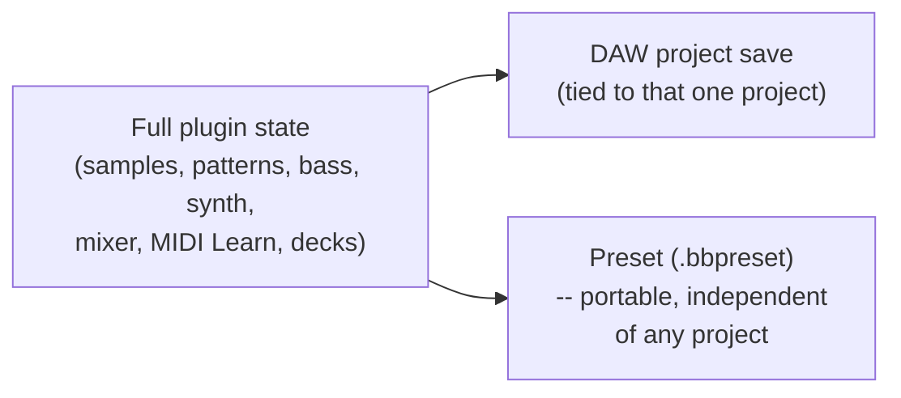

[&larr; Back to Usage overview](../USAGE.md) | [INSTALL](../INSTALL.md) | [LICENSE](../LICENSE.md) | [CHANGELOG](../CHANGELOG.md)

# Saving your work

Everything saves with your DAW project: every pad's sample and sound
settings in all four banks, the patterns (with their pitch, length and
groove), the bass line, the synth and its KEYS part, the arrangement, the
mixer (levels, routing, buses and effects), MIDI Learn bindings and the
decks' records — reopening the project restores everything, as long
as the original sample files haven't moved or been deleted. Presets
(Save/Load in the toolbar) capture the exact same full state as a portable,
named file independent of any project — see [The
toolbar](modules/toolbar/toolbar-and-presets.md).

# Running as a standalone app

The installer's Standalone component (or a manual build's
`Boom Bap Producer Pads.exe`) is the same plugin, running on its own
without a DAW. On first launch, use its audio settings to pick an output
device (and a MIDI input if you want to play it from a controller).

There's no DAW transport to drive the step sequencer in standalone mode, so
the toolbar's **Play** button (or the **Seq Play** toggle next to Roll)
runs it, at the tempo in the toolbar's **BPM** box (type it, drag it, or
**Tap** it). It has no effect when the plugin is
loaded inside a real DAW (the DAW's own transport is always in control
there); pads, Roll, the turntable, and the keyboard/piano-roll all trigger
normally in standalone mode regardless of this toggle.

## Your work is saved as you go

The Standalone keeps your session -- pads, decks, settings -- and brings it
back next time you open it. Besides saving when you close it, it now saves
every 30 seconds while you work (only when something changed), so a crash,
a forced restart or a power cut costs you at most the last half-minute.

**Open it once at a time.** Two Standalone windows share one place to keep
your work, so whichever you close last is what you'll find next time. If
you open a second one, it tells you, and it doesn't save as you go -- close
it and carry on in the first.

## If the Standalone closes unexpectedly

If the Standalone ever crashes, it saves a short **crash report** on your
computer first: which version it was, what went wrong ("access violation",
say) and where in the program it stopped. It holds no recordings, none of
your files and no settings, and your Windows user name is taken out.

Nothing is sent anywhere by itself. The next time you open the Standalone,
it asks what to do with the report:

- **Send report...** opens a new issue on the plugin's GitHub page in your
  web browser, with the report already filled in. Read it, add what you
  were doing if you remember, and submit it (you need a free GitHub
  account). The report is also copied, so you can paste it into an email
  or a message instead.
- **Not now** leaves it.
- **Don't ask again** stops these questions.

To read a report without sending it, open the folder: reports are kept in `%APPDATA%\Boom Bap Producer Pads\CrashReports` (the
last ten). Delete them whenever you like.

In a DAW, the plugin doesn't do this: a crash there is the DAW's to catch
and report, and a plugin mustn't take that over.
