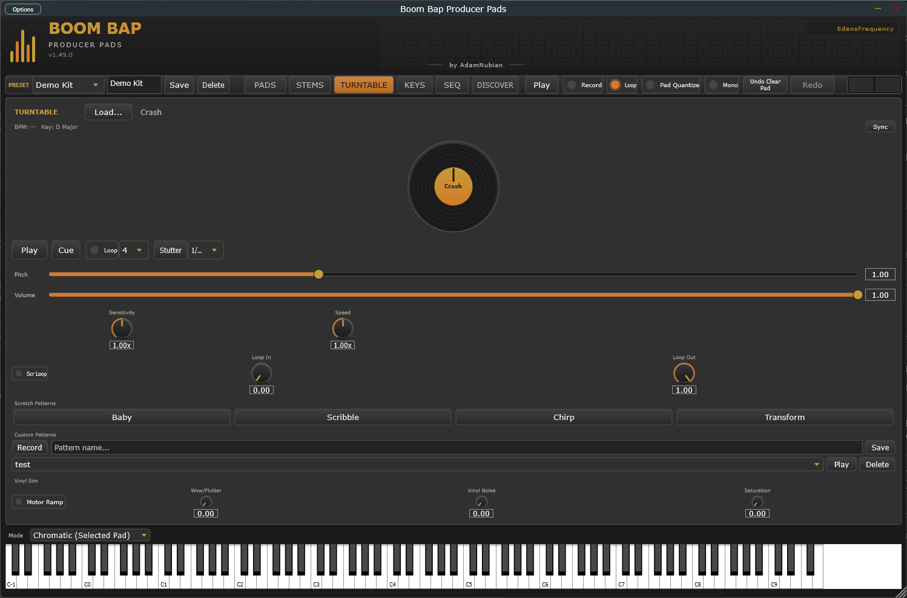

[&larr; Back to Usage overview](../USAGE.md)

# TURNTABLE tab

One dedicated deck, separate from the 16 pads — its own sample slot, not
tied to pad selection.

- **Load...** or **drag an audio file** onto the panel to load a sample
  onto the deck.
- **Click-drag the platter** to scratch: dragging clockwise plays forward,
  counter-clockwise reverses, and the pitch follows how fast you drag.
  Release to resume normal playback from wherever the scratch left off.
- **Play / Pause** — normal playback at the current pitch.
- **Cue** — stops and jumps back to the start.
- **Pitch** fader — 0.5x–2.0x playback speed when not scratching.
- **Volume** fader — deck output level.
- **EQ / Filter / Reverb** — Low/Mid/High EQ (±24dB), a Filter knob
  (sweeps low-pass to high-pass through a neutral centre), and a Reverb
  send, all real host-automatable parameters.
- **Loop** — repeats a beat-length region from wherever playback
  currently is (needs a detected BPM, see the BPM/Key readout).
- **Stutter** — hold-to-engage rapid retrigger of a short slice, rate
  selectable (1/4 to 1/32).
- **Scratch Patterns** — Baby/Scribble/Chirp/Transform presets replay a
  canned scratch gesture; **Record** captures your own platter moves as a
  named custom pattern to replay later.
- **Vinyl Sim** — Wow/Flutter, Vinyl Noise, and Saturation knobs (0–100%,
  no effect at 0) plus a **Motor Ramp** toggle (spins up to speed from a
  stop instead of starting instantly). All off by default.

The platter also responds to an external MIDI jog-wheel controller, not
just mouse drag: Note On/Off at note 20 touches/releases the platter, and
CC 20 carries relative jog motion (the standard sign-magnitude relative-
encoder convention most DJ jog wheels already speak) — both on MIDI
channel 1. Useful if you're driving this from a hardware controller or a
DAW MIDI script rather than the mouse.
